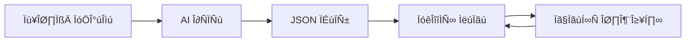

# Build MediTemplate AI PoC

## Metadata

| Field | Value |
|-------|-------|
| **Trajectory ID** | `bf640886-81ef-4d81-8cc1-e349fb7e7816` |
| **Cascade ID** | `0892c0e8-9c6c-47ab-a129-82d1f2f63aed` |
| **Type** | Agent Conversation |
| **Total Steps** | 129 |
| **Started** | 24 Jan 2026, 1:38 am |
| **Completed** | 24 Jan 2026, 2:14 am |

---

## User Request

# 📄 Project: Auto-Template Generator (PoC)

## 1. Project Overview

* **Goal:** 병원 의료진의 비정형 요구사항(손그림, 스캔된 문서 등)을 AI를 통해 정형화된 데이터 구조(Structured JSON)로 변환하고, 이를 웹상에서 즉시 렌더링하여 검증하는 도구 개발.
* **Target User:** 의료 영상 템플릿 기획자 및 엔지니어.
* **Core Value:** 수작업으로 진행되던 템플릿 기획-구현 간의 간극을 줄이고, UI 구조화 시간을 단축함.

## 2. User Flow

1. **Upload:** 사용자가 손그림 이미지(JPG/PNG)를 업로드한다.
2. **AI Analysis:** 시스템이 이미지를 분석하여 계층적(Tree) 구조의 JSON을 생성한다.
3. **JSON Editor:** 생성된 JSON 코드가 에디터 창에 표시되며, 사용자가 직접 수정할 수 있다.
4. **Live Preview:** JSON 내용이 실시간으로 우측 화면에 실제 Form UI(HTML)로 렌더링되어 구조가 맞는지 시각적으로 확인한다.

## 3. Functional Requirements (FR)

### FR-1. Input Processing

* 단일 이미지 업로드 지원 (JPG, PNG).
* *Note:* 추후 텍스트(Markdown) 확장을 고려하여 내부 로직은 모듈화할 것.

### FR-2. AI Generation (Vision-to-JSON)

* **Model:** Gemini 1.5 Pro (Vision) 또는 GPT-4o.
* **Task:** 이미지 내의 UI 요소와 레이아웃을 파악하여 정의된 JSON Schema에 맞게 변환.
* **Support Components:**
* `Section` (그룹핑을 위한 컨테이너)
* `Label` (단순 텍스트 라벨)
* `TextInput` (한 줄 입력)
* `TextArea` (여러 줄 입력)
* `RadioGroup` (단일 선택)
* `CheckboxGroup` (다중 선택)


### FR-3. UI Interface (Streamlit 권장)

* **Layout:** 2-Column Layout (Wide Mode).
* **Left Column:** 이미지 업로더 & JSON 에디터.
* **Right Column:** Live Rendered UI (Form 미리보기).


* **Error Handling:** JSON 문법 오류 시 렌더링 화면에 에러 메시지 표시.

---

## 4. Technical Specifications

### 4.1. Technology Stack

* **Language:** Python 3.9+
* **Framework:** Streamlit (빠른 UI 프로토타이핑 최적화)
* **AI Integration:** LangChain or Google Generative AI SDK
* **Data Validation:** Pydantic (JSON 스키마 검증용)

### 4.2. JSON Schema Definition (Hierarchical Tree)

*이 스키마 구조를 AI 모델의 System Prompt에 제공해야 함.*

```json
{
  "definitions": {
    "ComponentType": "section" | "text_input" | "text_area" | "radio_group" | "checkbox_group" | "label",
    "Component": {
      "id": "string (unique uuid)",
      "type": "ComponentType",
      "label": "string (display name)",
      "options": ["string"] (required for radio/checkbox, null otherwise),
      "placeholder": "string (optional)",
      "children": ["Component"] (recursive list, only for 'section')
    }
  },
  "root": {
    "title": "Report Template Name",
    "structure": ["Component"]
  }
}

```

### 4.3. System Prompt Strategy

* **Role:** Expert Medical UI/UX Designer & Data Structurer.
* **Instruction:**
1. Analyze the provided image of a medical report form.
2. Extract the logical structure and components.
3. Map them strictly to the provided JSON Schema.
4. Ignore strictly decorative elements, focus on data entry fields and sections.
5. For handwritten text that is unclear, use a placeholder like "[Unclear Text]".
6. **Output JSON ONLY.** No markdown block formatting, no explanatory text.


---

## 5. Development Tasks (Prompt for Antigravity)

**[Copy & Paste this into Antigravity]**

> **Role:** You are an expert Full Stack Python Developer specialized in Streamlit and LLM applications.
> **Task:** Build a PoC application called "MediTemplate AI" based on the following requirements.
> **1. Tech Stack:**
> * Python, Streamlit.
> * `google-generativeai` library for using Gemini 1.5 Pro Vision.
> 
> 
> **2. Core Logic:**
> * User uploads an image.
> * Send image to Gemini API with a system prompt to convert it into a hierarchical JSON structure.
> * The JSON structure MUST support nested Sections.
> * Supported types: `section`, `label`, `text_input`, `text_area`, `radio_group`, `checkbox_group`.
> 
> 
> **3. UI Layout:**
> * Use `st.set_page_config(layout="wide")`.
> * **Sidebar:** API Key Input.
> * **Main Area (2 Columns):**
> * **Col 1:** Image Uploader + `st.text_area` (containing the JSON output, editable).
> * **Col 2:** "Live Preview". A recursive function that takes the JSON from Col 1 and renders actual Streamlit widgets (`st.text_input`, `st.radio`, etc.).
> 
> 
> 
> 
> **4. Special Requirement (JSON Schema):**
> * The JSON output from the LLM must strictly follow this structure:
> `{ "title": "...", "structure": [ { "type": "...", "label": "...", "children": [...] } ] }`
> * Implement a recursive renderer function `render_component(component)` to handle the nested `children` in 'section' type.
> 
> 
> **Action:**
> Please generate the full `app.py` code and a `requirements.txt` file. Ensure error handling for invalid JSON in the editor.

---

---

<details>
<summary>Conversation History</summary>

# Conversation History
Here are the conversation IDs, titles, and summaries of your most recent 20 conversations, in reverse chronological order:

<conversation_summaries>
## Conversation 1d95adfd-3f25-4b2f-b68e-58994488e54f: Archive Specific Items Only
- Created: 2026-01-20T16:24:35Z
- Last modified: 2026-01-20T16:28:47Z

### USER Objective:
Archive Specific Items Only
The user wants to modify the archiving process to only include items that are explicitly mentioned by them and have a completion checkbox checked (marked with `[x]`). This change should be applied to the archiving protocol described in the `AGENTS_KR.md` document.

## Conversation e9154236-c8e8-40a1-afd6-cdd9630cab22: ICT Photo Submission Deadline
- Created: 2026-01-19T10:24:41Z
- Last modified: 2026-01-19T10:35:30Z

### USER Objective:
ICT Photo Submission Deadline
The user needs to submit photos via a Google Form for an ICT internship selection by 3:00 PM on January 20th. They were selected for the program on January 19th.

## Conversation 03d9ba36-9886-4034-b16d-b2bb61d7426f: SmartEndo Purchase and Task Completion
- Created: 2026-01-19T10:18:51Z
- Last modified: 2026-01-19T10:21:45Z

### USER Objective:
SmartEndo Purchase and Task Completion

The user wants to track the progress of the SmartEndo H/W purchase, which is currently awaiting approval after the payment request has been submitted. Additionally, the user needs to complete an internship assignment for the ITC credit-linked project by submitting photos via a Google Form before the deadline on January 20th. The user also wants a summary of completed tasks.

## Conversation 9713a36a-724d-4bec-a358-8622c1ba657f: Archive Location Change
- Created: 2026-01-19T09:59:52Z
- Last modified: 2026-01-19T10:01:32Z

### USER Objective:
Archive Location Change

The user wants to change the archive location structure to `엄정권/Archive/2026/Daily/2025-01-3w/2025-01-19.md` and apply this change to all related documents.

## Conversation ced0b381-eaac-44ee-b449-559e3676f5e8: ICT Proposal Submission Complete
- Created: 2026-01-19T09:37:57Z
- Last modified: 2026-01-19T09:39:00Z

### USER Objective:
ICT Proposal Submission Complete
The user has successfully submitted the first version of the PPT for the ICT Proposal new task presentation and also submitted the research plan. The team leader will proceed with the remaining tasks in the Hancom file.

## Conversation f0933c45-190c-443e-9142-6280bf9f4a2f: ICT_Proposal 신규 과제 발표용 PPT 제출 완료(1차버전), 연구계획서도 제출 완료
<truncated 54 bytes>
- Created: 2026-01-19T09:36:20Z
- Last modified: 2026-01-19T09:36:21Z

## Conversation f6ef3e53-53db-4777-9e7e-331c1673f982: Convert Markdown to Docx
- Created: 2026-01-18T06:14:37Z
- Last modified: 2026-01-19T09:33:29Z

### USER Objective:
Convert Markdown to Docx

The user's main objective is to convert the Markdown document `연구개발계획서_v4_연구내용.md` (which has been updated with the latest content regarding IAP and Oracle DB integration) into a DOCX file. Their goal is to use the `md-to-docx` skill for this conversion, ensuring the final DOCX file reflects all recent edits.

## Conversation 0c9fb8be-358a-48f7-a4f3-077d17ad472e: Infographic for Agentic Loop
- Created: 2026-01-19T05:23:47Z
- Last modified: 2026-01-19T05:49:30Z

### USER Objective:
Infographic for Agentic Loop
The user wants to create an infographic for the "Agentic Reasoning Loop" section of the document. Their goal is to visually represent the Perception -> Reasoning -> Action -> Observation loop described in the text.

## Conversation d232201c-7c12-44c5-a7c6-e137b25024d7: Updating GATC Technology Examples
- Created: 2026-01-19T01:47:31Z
- Last modified: 2026-01-19T04:34:24Z

### USER Objective:
Updating GATC Technology Examples

The user's main objective is to update the GATC technology examples document (`GATC_기술예시.md`) to reflect the changes made during the research proposal's V1 to V4 improvement iterations. Their goals are to:
1. Analyze and document the technical items that were modified, deleted, or added across the improvement stages.
2. Review the original `GATc_기술예시.md` and compare it with the final `연구개발계획서_v4_연구내용.md`, considering evaluation materials from improvement folders.
3. Create an intermediate analysis file (`변경분석_중간결과.md`) to summarize the identified changes.
4. Generate a final updated document named `GATC_기술예시_V1.md`.
5. Convert the final Markdown document to DOCX format.

## Conversation 528df98f-cc48-4552-b36e-90a3b2c42cae: Create Git Commit Message
- Created: 2026-01-18T16:04:53Z
- Last modified: 2026-01-18T16:05:36Z

### USER Objective:
Create Git Commit Message
The user wants to create a Git commit message. They have already run `git status` and are looking for a way to generate a commit message. They have also listed several other open documents and their current active document is a Python file.

## Conversation 710cfcca-9c67-48d7-8814-cb2557d32c93: Infographic for Agentic Loop
- Created: 2026-01-18T06:22:43Z
- Last modified: 2026-01-18T06:23:54Z

### USER Objective:
Infographic for Agentic Loop
The user's main objective is to enhance the `연구개발계획서_v3_연구내용.md` document by creating an infographic for the "자율적 추론 및 실행 루프 (Agentic Reasoning Loop)" section (2.1). This action contributes to the broader goal of improving the document's presentation and clarity for its V4 revision.

## Conversation 024d4b1a-a3e6-4895-be4b-c2dba9aa74db: Refining Proposal Layout
- Created: 2026-01-15T08:07:23Z
- Last modified: 2026-01-18T05:46:31Z

### USER Objective:
Refining Proposal Layout
The user's main objective is to improve the readability and organization of the `연구개발계획서_v3.md` document. Their goals are to:
1. Reformat the entire document to ensure a clean and logical layout.
2. Apply standard Markdown practices for headers, lists, and emphasis to enhance readability.
3. Ensure the document is well-structured and easy to navigate.

## Conversation 2c6daf73-258f-49fb-95e6-9bc97422a06b: Convert Markdown to Docx
- Created: 2026-01-15T07:53:35Z
- Last modified: 2026-01-15T07:57:36Z

### USER Objective:
Convert Markdown to Docx

The user's main objective is to convert the Markdown document `연구개발계획서_v2.md` into a DOCX file. Their goal is to use the `pandoc` tool to perform this conversion.

## Conversation a4d8c75e-6cb7-4551-b846-409a6b091246: Refining AI Monitoring Proposal
- Created: 2026-01-14T01:54:23Z
- Last modified: 2026-01-15T07:39:31Z

### USER Objective:
Refining AI Monitoring Proposal
The user's main objective is to significantly enhance the AI-related technical content of the draft GATC research proposal (`연구개발계획서_초안.md`) to develop an agent-based new medical imaging system. This system aims to revolutionize the radiology workflow by making AI an "Invisible Teammate."

**Current Goals:**
1.  Ensure the "AI Model Performance Monitoring" concept, including its definition, LLM-based engine utilization, and benefits for hospitals, AI vendors, and regulatory compliance, is fully integrated into both `컨셉정의서_Agentic_Workflow.md` and `연구개발계획서_v2.md`.
2.  Prepare for the next project phase by drafting a 10-20 page presentation (PPT) for management, outlining core concepts, modules, architecture, roadmap, and benefits.
3.  Conduct research to provide strong justification for key technical aspects: Cascaded Inference (Cost-Performance Routing), Orchestrator Model Capabilities (comparing K-Foundation Mod
<truncated 297 bytes>

## Conversation 3a4c1601-ffa7-40ed-9738-69854c116b83: ICT Proposal Meeting Preparation
- Created: 2026-01-14T01:05:30Z
- Last modified: 2026-01-14T06:29:32Z

### USER Objective:
ICT Proposal Meeting Preparation
The user wants to hold a meeting to create an ICT proposal and needs help organizing the relevant context for it.

## Conversation 3941cfa8-f33a-4c82-89b4-ce0d07eeb767: Summarize Issue 151865
- Created: 2026-01-12T14:22:51Z
- Last modified: 2026-01-12T14:24:43Z

### USER Objective:
Summarize Issue 151865
The user's main objective is to access the provided URL (https://src.infinitt.com/issues/151865) and summarize the issue content. Their goals are to:
1. Navigate to the specified issue page.
2. Extract and summarize the issue's details, including Title, Description, Status, and any comments, if accessible.
3. Determine if the page requires a login.
4. Report "Login Required" if access is restricted by a login page.
5. Report "Connection Failed" if the page cannot be reached.

## Conversation 8ef65146-220d-40aa-a939-379fcfd7bc1b: Updating AGENTS_KR.md Document
- Created: 2026-01-05T16:01:58Z
- Last modified: 2026-01-12T13:49:24Z

### USER Objective:
Updating AGENTS_KR.md Document
The user's main objective is to update the AGENTS_KR.md file to reflect a change in the daily closing procedure. Their goal is to modify the document so that at the end of the day, existing "Today Event" items are archived, and relevant items from "Future Plan" are moved to "Today Event" for the next day.

## Conversation 98656b09-1aa6-4431-bb30-a631d01a18b5: Identify Infinitt Company Profile
- Created: 2026-01-12T13:10:02Z
- Last modified: 2026-01-12T13:11:35Z

### USER Objective:
Identify Infinitt Company Profile
The user's main objective is to understand what kind of company Infinitt is. Their goals are to:
1. Visit the infinitt.com website.
2. Determine the company's main business.
3. Identify its primary products, such as PACS or other Healthcare IT solutions.
4. Discover any key mission statements or company values.

## Conversation a319bc40-e617-445a-8b97-c75a4f67a63b: Navigate Antigravity Google
- Created: 2026-01-12T13:08:49Z
- Last modified: 2026-01-12T13:09:30Z

### USER Objective:
Navigate Antigravity Google
The user's main objective is to navigate to the `antigravity.google` website. Their goals are to:
1. Successfully open the `antigravity.google` page in the browser.
2. Verify that the correct page has loaded.

## Conversation 66f27039-2c57-47d1-b085-790b71804117: Explain Oh My OpenCode Installation
- Created: 2026-01-12T12:04:03Z
- Last modified: 2026-01-12T12:05:28Z

### USER Objective:
Explain Oh My OpenCode Installation
The user's main objective is to understand the installation process for Oh My OpenCode. Their goals are to:
1. Follow the installation steps for humans.
2. Install OpenCode if it's not already installed.
3. Run the installer.
4. Verify the setup.
5. Configure authentication.

</conversation_summaries>

</details>

---

<details>
<summary>System Message</summary>

The following is an <EPHEMERAL_MESSAGE> not actually sent by the user. It is provided by the system as a set of reminders and general important information to pay attention to. Do NOT respond to this message, just act accordingly.

<EPHEMERAL_MESSAGE>
<artifact_reminder>
You have not yet created any artifacts. Please follow the artifact guidelines and create them as needed based on the task.
CRITICAL REMINDER: remember that user-facing artifacts should be AS CONCISE AS POSSIBLE. Keep this in mind when editing artifacts.
</artifact_reminder>
<no_active_task_reminder>
You are currently not in a task because: a task boundary has never been set yet in this conversation.
If there is no obvious task from the user or if you are just conversing, then it is acceptable to not have a task set. If you are just handling simple one-off requests, such as explaining a single file, or making one or two ad-hoc code edit requests, or making an obvious refactoring request such as renaming or moving code into a helper function, it is also acceptable to not have a task set.
Otherwise, you should use the task_boundary tool to set a task if there is one evident.
Remember that task boundaries should correspond to the artifact task.md, if you have not created the artifact task.md, you should do that first before setting the task_boundary. Remember that task names should be granular and correspond to top-level checklist items, not the entire user request as one task name. If you decide to use the task boundary tool, you must do so concurrently with other tools.
Since you are NOT in an active task section, DO NOT call the `notify_user` tool unless you are requesting review of files.
</no_active_task_reminder>
</EPHEMERAL_MESSAGE>

**Triggered Heuristics:** artifact_reminder, no_active_task_reminder

</details>

---

## Agent Response

### Thinking

The user wants me to build a PoC application called "MediTemplate AI" - a Streamlit application that:
1. Accepts image uploads of hand-drawn medical forms
2. Uses Gemini 1.5 Pro Vision to convert images to structured JSON
3. Displays an editable JSON editor
4. Renders a live preview of the form based on the JSON

This is a substantial task that requires planning and implementation. Let me start by creating the task.md and implementation plan.

### Actions

**Tool:** `task_boundary`

**Tool:** `list_dir`
**Path:** `/Users/infinitt/.gemini/antigravity/playground/prime-ionosphere`

<details>
<summary>Metadata</summary>

- **Thinking Duration:** 5.911989s
- **Model:** Claude Opus 4.5 (Thinking)
</details>

---

### Logical Breakpoint

**Status:** Completed
**Created:** 24 Jan 2026, 1:38 am

---

<details>
<summary>Directory: `prime-ionosphere` (2 items)</summary>

**Path:** `Users/infinitt/.gemini/antigravity/playground/prime-ionosphere`

| Name | Type | Size |
|------|------|------|
| `.chatledger` | Directory | - |
| `.vscode` | Directory | 1 items |

</details>

---

<details>
<summary>System Message</summary>

The following is an <EPHEMERAL_MESSAGE> not actually sent by the user. It is provided by the system as a set of reminders and general important information to pay attention to. Do NOT respond to this message, just act accordingly.

<EPHEMERAL_MESSAGE>
<active_task_reminder>Remember to update the task as appropriate. The current task is: task_name:"Planning MediTemplate AI Application" task_status:"Creating task breakdown and implementation plan" task_summary:"Starting development of MediTemplate AI - a Streamlit-based PoC for converting hand-drawn medical forms to structured JSON with live preview." mode:AGENT_MODE_PLANNING
As a rule of thumb, you should update the status and summary around once every 5 tools. You have not updated the task in 1 tools since the last update. You should make task boundary updates concurrently with other tools when starting new work phases, STARTING with the task boundary tool if calling multiple.
Do not update the status too frequently, leave at minimum two tool calls in between status updates. Too frequent updates will overwhelm the user. Never make two status updates in a row without doing anything in between.
If you are going to either update the task boundary OR update the artifact task.md file you should do so concurrently with other tools, starting with the task boundary before calling other tools. When using the task boundary if you are going to use the same task name / task status / task summary as the current task use <SAME> as the argument value for the corresponding field instead.
CRITICAL REMINDER: The TaskStatus argument for task boundary should describe the NEXT STEPS, NOT the previous steps. The TaskSummary is used to describe the previous steps.
REMEMBER: since you are in the middle of a task, the user WILL NOT SEE ANY OF YOUR MESSAGES. THE ONLY WAY TO COMMUNICATE WITH THE USER IS VIA THE notify_user TOOL.
YOUR CURRENT MODE IS: AGENT_MODE_PLANNING. Make sure to embody this mindset as explained in your system prompt. Take this very seriously.
</active_task_reminder>

<artifact_reminder>
You have not yet created any artifacts. Please follow the artifact guidelines and create them as needed based on the task.
CRITICAL REMINDER: remember that user-facing artifacts should be AS CONCISE AS POSSIBLE. Keep this in mind when editing artifacts.
</artifact_reminder>
<planning_mode_no_plan_reminder>
You are in PLANNING mode but haven't written an implementation plan yet. If this task requires code changes, you should write an implementation plan and notify the user for review before proceeding to EXECUTION mode. If this is just research or read-only work, you can proceed without a plan.

		Remember there are 2 key parts to the implementation plan. You need to write a summary of the code changes you will make based on your system prompt, and how you plan to verify the changes.
		When coming up with the verification plan, every test (whether it's unittest / integration / using the browser / user manual testing etc.) **MUST** have explicit instructions on how to run the test so another agent can run the test.
		Before you write the plan, you **MUST** try discover by searching/listing/viewing files if there are any existing tests you can use to verify the changes. When you do find tests you should read to understand what the test covers and what it doesn't to determine what new tests you might want to add. DO NOT MAKE UP TESTS. Make sure you read the test or build files so you are 100% sure the command to run the test is correct.
		You can also propose to write a new test, but make sure you add it to the plan and be specific about HOW you are writing the new test. DO NOT MAKE TESTS UP TO SATISFY THE CONDITION.
		If you are writing up a manual test, make sure the steps are OBVIOUSLY clear to a human. Don't be shy and FEEL FREE to ask the human for suggestions on how to manually test. If you're not 100% confident that the manual test works then don't add any manual test. Make sure the manual tests are OBVIOUS to follow for someone who may not be familiar with the codebase.
		It is better if you ask the user for help instead of making tests up on the spot. THIS IS REALLY IMPORTANT.
		
</planning_mode_no_plan_reminder>
</EPHEMERAL_MESSAGE>

**Triggered Heuristics:** active_task_reminder, artifact_reminder, planning_mode_no_plan_reminder

</details>

---

## Agent Response

<details>
<summary>Metadata</summary>

- **Model:** Claude Opus 4.5 (Thinking)
</details>

---

### Execution Error

**Status:** Completed
**Created:** 24 Jan 2026, 1:38 am

---

## Agent Response

### Actions

**Tool:** `write_to_file`

**Tool:** `write_to_file`

<details>
<summary>Metadata</summary>

- **Model:** Claude Opus 4.5 (Thinking)
</details>

---

### Code Edit

**Status:** Completed
**Created:** 24 Jan 2026, 1:38 am

---

### Code Edit

**Status:** Completed
**Created:** 24 Jan 2026, 1:38 am

---

<details>
<summary>System Message</summary>

The following is an <EPHEMERAL_MESSAGE> not actually sent by the user. It is provided by the system as a set of reminders and general important information to pay attention to. Do NOT respond to this message, just act accordingly.

<EPHEMERAL_MESSAGE>
<active_task_reminder>Remember to update the task as appropriate. The current task is: task_name:"Planning MediTemplate AI Application" task_status:"Creating task breakdown and implementation plan" task_summary:"Starting development of MediTemplate AI - a Streamlit-based PoC for converting hand-drawn medical forms to structured JSON with live preview." mode:AGENT_MODE_PLANNING
As a rule of thumb, you should update the status and summary around once every 5 tools. You have not updated the task in 3 tools since the last update. You should make task boundary updates concurrently with other tools when starting new work phases, STARTING with the task boundary tool if calling multiple.
Do not update the status too frequently, leave at minimum two tool calls in between status updates. Too frequent updates will overwhelm the user. Never make two status updates in a row without doing anything in between.
If you are going to either update the task boundary OR update the artifact task.md file you should do so concurrently with other tools, starting with the task boundary before calling other tools. When using the task boundary if you are going to use the same task name / task status / task summary as the current task use <SAME> as the argument value for the corresponding field instead.
CRITICAL REMINDER: The TaskStatus argument for task boundary should describe the NEXT STEPS, NOT the previous steps. The TaskSummary is used to describe the previous steps.
REMEMBER: since you are in the middle of a task, the user WILL NOT SEE ANY OF YOUR MESSAGES. THE ONLY WAY TO COMMUNICATE WITH THE USER IS VIA THE notify_user TOOL.
YOUR CURRENT MODE IS: AGENT_MODE_PLANNING. Make sure to embody this mindset as explained in your system prompt. Take this very seriously.
</active_task_reminder>

<artifact_reminder>
You have created the following artifacts in this conversation so far, here are the artifact paths:
/Users/infinitt/.gemini/antigravity/brain/359d36ee-116c-494f-b3cf-45974dde6806/task.md
/Users/infinitt/.gemini/antigravity/brain/359d36ee-116c-494f-b3cf-45974dde6806/implementation_plan.md
CRITICAL REMINDER: remember that user-facing artifacts should be AS CONCISE AS POSSIBLE. Keep this in mind when editing artifacts.
</artifact_reminder>
<planning_mode_plan_edited_reminder>
You have modified implementation_plan.md during this task, before you switch to EXECUTION mode you should notify and request the user to review your implementation plan changes.
</planning_mode_plan_edited_reminder>
</EPHEMERAL_MESSAGE>

**Triggered Heuristics:** active_task_reminder, artifact_reminder, planning_mode_plan_edited_reminder

</details>

---

## Agent Response

### Actions

**Tool:** `notify_user`

<details>
<summary>Metadata</summary>

- **Model:** Claude Opus 4.5 (Thinking)
</details>

---

### System Notification

**Status:** Completed
**Created:** 24 Jan 2026, 1:38 am

---

## User Request

계획을 한글로 작성해줘. 그리고 prd와 spec은 별도의 md파일로 저장해두고 진행해

---

<details>
<summary>System Message</summary>

The following is an <EPHEMERAL_MESSAGE> not actually sent by the user. It is provided by the system as a set of reminders and general important information to pay attention to. Do NOT respond to this message, just act accordingly.

<EPHEMERAL_MESSAGE>
<artifact_reminder>
You have created the following artifacts in this conversation so far, here are the artifact paths:
/Users/infinitt/.gemini/antigravity/brain/359d36ee-116c-494f-b3cf-45974dde6806/task.md
/Users/infinitt/.gemini/antigravity/brain/359d36ee-116c-494f-b3cf-45974dde6806/implementation_plan.md
CRITICAL REMINDER: remember that user-facing artifacts should be AS CONCISE AS POSSIBLE. Keep this in mind when editing artifacts.
</artifact_reminder>
<no_active_task_reminder>
You are currently not in a task because: there has been a CORTEX_STEP_TYPE_NOTIFY_USER action since the last task boundary.
If there is no obvious task from the user or if you are just conversing, then it is acceptable to not have a task set. If you are just handling simple one-off requests, such as explaining a single file, or making one or two ad-hoc code edit requests, or making an obvious refactoring request such as renaming or moving code into a helper function, it is also acceptable to not have a task set.
Otherwise, you should use the task_boundary tool to set a task if there is one evident.
Remember that task boundaries should correspond to the artifact task.md, if you have not created the artifact task.md, you should do that first before setting the task_boundary. Remember that task names should be granular and correspond to top-level checklist items, not the entire user request as one task name. If you decide to use the task boundary tool, you must do so concurrently with other tools.
Since you are NOT in an active task section, DO NOT call the `notify_user` tool unless you are requesting review of files.
</no_active_task_reminder>
<requested_review_not_in_planning_mode_reminder>
You have used notify_user with implementation_plan.md but haven't set a task boundary since. If the user wants to continue working on the current plan, based on the user intent you should either: (1) Enter PLANNING mode to update the plan (feel free to do additional research based on the user feedback), OR (2) Enter EXECUTION mode and proceed to implement the plan without user feedback. Under no circumstances should you update the implementation_plan.md when you're not in a task.
</requested_review_not_in_planning_mode_reminder>
</EPHEMERAL_MESSAGE>

**Triggered Heuristics:** artifact_reminder, no_active_task_reminder, requested_review_not_in_planning_mode_reminder

</details>

---

## Agent Response

### Thinking

The user wants me to:
1. Write the plan in Korean
2. Save PRD and Spec as separate MD files

Let me update the implementation plan in Korean and create separate PRD and Spec documents.

### Actions

**Tool:** `task_boundary`

<details>
<summary>Metadata</summary>

- **Thinking Duration:** 3.385988s
- **Model:** Claude Opus 4.5 (Thinking)
</details>

---

### Logical Breakpoint

**Status:** Completed
**Created:** 24 Jan 2026, 1:41 am

---

<details>
<summary>System Message</summary>

The following is an <EPHEMERAL_MESSAGE> not actually sent by the user. It is provided by the system as a set of reminders and general important information to pay attention to. Do NOT respond to this message, just act accordingly.

<EPHEMERAL_MESSAGE>
<active_task_reminder>Remember to update the task as appropriate. The current task is: task_name:"Planning MediTemplate AI Application" task_status:"PRD, Spec, 구현 계획서를 한글로 작성" task_summary:"기존 구현 계획을 한글로 변환하고 PRD/Spec 문서를 분리 작성 중." mode:AGENT_MODE_PLANNING
As a rule of thumb, you should update the status and summary around once every 5 tools. You have not updated the task in 0 tools since the last update. You should make task boundary updates concurrently with other tools when starting new work phases, STARTING with the task boundary tool if calling multiple.
Do not update the status too frequently, leave at minimum two tool calls in between status updates. Too frequent updates will overwhelm the user. Never make two status updates in a row without doing anything in between.
If you are going to either update the task boundary OR update the artifact task.md file you should do so concurrently with other tools, starting with the task boundary before calling other tools. When using the task boundary if you are going to use the same task name / task status / task summary as the current task use <SAME> as the argument value for the corresponding field instead.
CRITICAL REMINDER: The TaskStatus argument for task boundary should describe the NEXT STEPS, NOT the previous steps. The TaskSummary is used to describe the previous steps.
REMEMBER: since you are in the middle of a task, the user WILL NOT SEE ANY OF YOUR MESSAGES. THE ONLY WAY TO COMMUNICATE WITH THE USER IS VIA THE notify_user TOOL.
YOUR CURRENT MODE IS: AGENT_MODE_PLANNING. Make sure to embody this mindset as explained in your system prompt. Take this very seriously.
</active_task_reminder>

<artifact_reminder>
You have created the following artifacts in this conversation so far, here are the artifact paths:
/Users/infinitt/.gemini/antigravity/brain/359d36ee-116c-494f-b3cf-45974dde6806/task.md
/Users/infinitt/.gemini/antigravity/brain/359d36ee-116c-494f-b3cf-45974dde6806/implementation_plan.md
CRITICAL REMINDER: remember that user-facing artifacts should be AS CONCISE AS POSSIBLE. Keep this in mind when editing artifacts.
</artifact_reminder>
</EPHEMERAL_MESSAGE>

**Triggered Heuristics:** active_task_reminder, artifact_reminder

</details>

---

## Agent Response

<details>
<summary>Metadata</summary>

- **Model:** Claude Opus 4.5 (Thinking)
</details>

---

### Execution Error

**Status:** Completed
**Created:** 24 Jan 2026, 1:41 am

---

## Agent Response

### Actions

**Tool:** `write_to_file`

**Tool:** `write_to_file`

**Tool:** `write_to_file`

<details>
<summary>Metadata</summary>

- **Model:** Claude Opus 4.5 (Thinking)
</details>

---

### Code Edit

**Status:** Completed
**Created:** 24 Jan 2026, 1:41 am

---

### Code Edit

**Status:** Completed
**Created:** 24 Jan 2026, 1:42 am

---

### Code Edit

**Status:** Completed
**Created:** 24 Jan 2026, 1:42 am

---

<details>
<summary>System Message</summary>

The following is an <EPHEMERAL_MESSAGE> not actually sent by the user. It is provided by the system as a set of reminders and general important information to pay attention to. Do NOT respond to this message, just act accordingly.

<EPHEMERAL_MESSAGE>
<active_task_reminder>Remember to update the task as appropriate. The current task is: task_name:"Planning MediTemplate AI Application" task_status:"PRD, Spec, 구현 계획서를 한글로 작성" task_summary:"기존 구현 계획을 한글로 변환하고 PRD/Spec 문서를 분리 작성 중." mode:AGENT_MODE_PLANNING
As a rule of thumb, you should update the status and summary around once every 5 tools. You have not updated the task in 3 tools since the last update. You should make task boundary updates concurrently with other tools when starting new work phases, STARTING with the task boundary tool if calling multiple.
Do not update the status too frequently, leave at minimum two tool calls in between status updates. Too frequent updates will overwhelm the user. Never make two status updates in a row without doing anything in between.
If you are going to either update the task boundary OR update the artifact task.md file you should do so concurrently with other tools, starting with the task boundary before calling other tools. When using the task boundary if you are going to use the same task name / task status / task summary as the current task use <SAME> as the argument value for the corresponding field instead.
CRITICAL REMINDER: The TaskStatus argument for task boundary should describe the NEXT STEPS, NOT the previous steps. The TaskSummary is used to describe the previous steps.
REMEMBER: since you are in the middle of a task, the user WILL NOT SEE ANY OF YOUR MESSAGES. THE ONLY WAY TO COMMUNICATE WITH THE USER IS VIA THE notify_user TOOL.
YOUR CURRENT MODE IS: AGENT_MODE_PLANNING. Make sure to embody this mindset as explained in your system prompt. Take this very seriously.
</active_task_reminder>

<artifact_reminder>
You have created the following artifacts in this conversation so far, here are the artifact paths:
/Users/infinitt/.gemini/antigravity/brain/359d36ee-116c-494f-b3cf-45974dde6806/task.md
/Users/infinitt/.gemini/antigravity/brain/359d36ee-116c-494f-b3cf-45974dde6806/implementation_plan.md
CRITICAL REMINDER: remember that user-facing artifacts should be AS CONCISE AS POSSIBLE. Keep this in mind when editing artifacts.
</artifact_reminder>
<planning_mode_plan_edited_reminder>
You have modified implementation_plan.md during this task, before you switch to EXECUTION mode you should notify and request the user to review your implementation plan changes.
</planning_mode_plan_edited_reminder>
</EPHEMERAL_MESSAGE>

**Triggered Heuristics:** active_task_reminder, artifact_reminder, planning_mode_plan_edited_reminder

</details>

---

## Agent Response

### Actions

**Tool:** `notify_user`

<details>
<summary>Metadata</summary>

- **Model:** Claude Opus 4.5 (Thinking)
</details>

---

### System Notification

**Status:** Completed
**Created:** 24 Jan 2026, 1:42 am

---

## User Request

---

<details>
<summary>System Message</summary>

The following is an <EPHEMERAL_MESSAGE> not actually sent by the user. It is provided by the system as a set of reminders and general important information to pay attention to. Do NOT respond to this message, just act accordingly.

<EPHEMERAL_MESSAGE>
<artifact_reminder>
You have created the following artifacts in this conversation so far, here are the artifact paths:
/Users/infinitt/.gemini/antigravity/brain/359d36ee-116c-494f-b3cf-45974dde6806/task.md
/Users/infinitt/.gemini/antigravity/brain/359d36ee-116c-494f-b3cf-45974dde6806/implementation_plan.md
CRITICAL REMINDER: remember that user-facing artifacts should be AS CONCISE AS POSSIBLE. Keep this in mind when editing artifacts.
</artifact_reminder>
<no_active_task_reminder>
You are currently not in a task because: there has been a CORTEX_STEP_TYPE_NOTIFY_USER action since the last task boundary.
If there is no obvious task from the user or if you are just conversing, then it is acceptable to not have a task set. If you are just handling simple one-off requests, such as explaining a single file, or making one or two ad-hoc code edit requests, or making an obvious refactoring request such as renaming or moving code into a helper function, it is also acceptable to not have a task set.
Otherwise, you should use the task_boundary tool to set a task if there is one evident.
Remember that task boundaries should correspond to the artifact task.md, if you have not created the artifact task.md, you should do that first before setting the task_boundary. Remember that task names should be granular and correspond to top-level checklist items, not the entire user request as one task name. If you decide to use the task boundary tool, you must do so concurrently with other tools.
Since you are NOT in an active task section, DO NOT call the `notify_user` tool unless you are requesting review of files.
</no_active_task_reminder>
<requested_review_not_in_planning_mode_reminder>
You have used notify_user with implementation_plan.md but haven't set a task boundary since. If the user wants to continue working on the current plan, based on the user intent you should either: (1) Enter PLANNING mode to update the plan (feel free to do additional research based on the user feedback), OR (2) Enter EXECUTION mode and proceed to implement the plan without user feedback. Under no circumstances should you update the implementation_plan.md when you're not in a task.
</requested_review_not_in_planning_mode_reminder>
</EPHEMERAL_MESSAGE>

**Triggered Heuristics:** artifact_reminder, no_active_task_reminder, requested_review_not_in_planning_mode_reminder

</details>

---

## Agent Response

### Thinking

The user has approved the implementation plan. Now I should proceed to EXECUTION mode and implement the application.

### Actions

**Tool:** `task_boundary`

**Tool:** `replace_file_content`

<details>
<summary>Metadata</summary>

- **Thinking Duration:** 8.889404s
- **Model:** Claude Opus 4.5 (Thinking)
</details>

---

### Logical Breakpoint

**Status:** Completed
**Created:** 24 Jan 2026, 1:43 am

---

### Code Edit

**Status:** Completed
**Created:** 24 Jan 2026, 1:43 am

---

<details>
<summary>System Message</summary>

The following is an <EPHEMERAL_MESSAGE> not actually sent by the user. It is provided by the system as a set of reminders and general important information to pay attention to. Do NOT respond to this message, just act accordingly.

<EPHEMERAL_MESSAGE>
<active_task_reminder>Remember to update the task as appropriate. The current task is: task_name:"Implementing MediTemplate AI Application" task_status:"프로젝트 파일 생성 (requirements.txt, app.py)" task_summary:"구현 계획이 승인되어 코드 작성 시작." mode:AGENT_MODE_EXECUTION
As a rule of thumb, you should update the status and summary around once every 5 tools. You have not updated the task in 1 tools since the last update. You should make task boundary updates concurrently with other tools when starting new work phases, STARTING with the task boundary tool if calling multiple.
Do not update the status too frequently, leave at minimum two tool calls in between status updates. Too frequent updates will overwhelm the user. Never make two status updates in a row without doing anything in between.
If you are going to either update the task boundary OR update the artifact task.md file you should do so concurrently with other tools, starting with the task boundary before calling other tools. When using the task boundary if you are going to use the same task name / task status / task summary as the current task use <SAME> as the argument value for the corresponding field instead.
CRITICAL REMINDER: The TaskStatus argument for task boundary should describe the NEXT STEPS, NOT the previous steps. The TaskSummary is used to describe the previous steps.
REMEMBER: since you are in the middle of a task, the user WILL NOT SEE ANY OF YOUR MESSAGES. THE ONLY WAY TO COMMUNICATE WITH THE USER IS VIA THE notify_user TOOL.
YOUR CURRENT MODE IS: AGENT_MODE_EXECUTION. Make sure to embody this mindset as explained in your system prompt. Take this very seriously.
</active_task_reminder>

<artifact_reminder>
You have created the following artifacts in this conversation so far, here are the artifact paths:
/Users/infinitt/.gemini/antigravity/brain/359d36ee-116c-494f-b3cf-45974dde6806/task.md
/Users/infinitt/.gemini/antigravity/brain/359d36ee-116c-494f-b3cf-45974dde6806/implementation_plan.md
CRITICAL REMINDER: remember that user-facing artifacts should be AS CONCISE AS POSSIBLE. Keep this in mind when editing artifacts.
</artifact_reminder>
</EPHEMERAL_MESSAGE>

**Triggered Heuristics:** active_task_reminder, artifact_reminder

</details>

---

## Agent Response

### Actions

**Tool:** `write_to_file`

**Tool:** `write_to_file`

<details>
<summary>Metadata</summary>

- **Model:** Claude Opus 4.5 (Thinking)
</details>

---

### Code Edit

**Status:** Completed
**Created:** 24 Jan 2026, 1:43 am

---

### Code Edit

**Status:** Completed
**Created:** 24 Jan 2026, 1:44 am

---

<details>
<summary>System Message</summary>

The following is an <EPHEMERAL_MESSAGE> not actually sent by the user. It is provided by the system as a set of reminders and general important information to pay attention to. Do NOT respond to this message, just act accordingly.

<EPHEMERAL_MESSAGE>
<active_task_reminder>Remember to update the task as appropriate. The current task is: task_name:"Implementing MediTemplate AI Application" task_status:"프로젝트 파일 생성 (requirements.txt, app.py)" task_summary:"구현 계획이 승인되어 코드 작성 시작." mode:AGENT_MODE_EXECUTION
As a rule of thumb, you should update the status and summary around once every 5 tools. You have not updated the task in 3 tools since the last update. You should make task boundary updates concurrently with other tools when starting new work phases, STARTING with the task boundary tool if calling multiple.
Do not update the status too frequently, leave at minimum two tool calls in between status updates. Too frequent updates will overwhelm the user. Never make two status updates in a row without doing anything in between.
If you are going to either update the task boundary OR update the artifact task.md file you should do so concurrently with other tools, starting with the task boundary before calling other tools. When using the task boundary if you are going to use the same task name / task status / task summary as the current task use <SAME> as the argument value for the corresponding field instead.
CRITICAL REMINDER: The TaskStatus argument for task boundary should describe the NEXT STEPS, NOT the previous steps. The TaskSummary is used to describe the previous steps.
REMEMBER: since you are in the middle of a task, the user WILL NOT SEE ANY OF YOUR MESSAGES. THE ONLY WAY TO COMMUNICATE WITH THE USER IS VIA THE notify_user TOOL.
YOUR CURRENT MODE IS: AGENT_MODE_EXECUTION. Make sure to embody this mindset as explained in your system prompt. Take this very seriously.
</active_task_reminder>

<artifact_reminder>
You have created the following artifacts in this conversation so far, here are the artifact paths:
/Users/infinitt/.gemini/antigravity/brain/359d36ee-116c-494f-b3cf-45974dde6806/task.md
/Users/infinitt/.gemini/antigravity/brain/359d36ee-116c-494f-b3cf-45974dde6806/implementation_plan.md
CRITICAL REMINDER: remember that user-facing artifacts should be AS CONCISE AS POSSIBLE. Keep this in mind when editing artifacts.
</artifact_reminder>
</EPHEMERAL_MESSAGE>

**Triggered Heuristics:** active_task_reminder, artifact_reminder

</details>

---

## Agent Response

### Actions

**Tool:** `task_boundary`

**Tool:** `replace_file_content`

**Tool:** `run_command`

<details>
<summary>Metadata</summary>

- **Model:** Claude Opus 4.5 (Thinking)
</details>

---

### Logical Breakpoint

**Status:** Completed
**Created:** 24 Jan 2026, 1:44 am

---

### Code Edit

**Status:** Completed
**Created:** 24 Jan 2026, 1:45 am

---

### Terminal Command Execution

**Status:** Completed
**Created:** 24 Jan 2026, 1:45 am

---

<details>
<summary>System Message</summary>

The following is an <EPHEMERAL_MESSAGE> not actually sent by the user. It is provided by the system as a set of reminders and general important information to pay attention to. Do NOT respond to this message, just act accordingly.

<EPHEMERAL_MESSAGE>
<active_task_reminder>Remember to update the task as appropriate. The current task is: task_name:"Verifying MediTemplate AI Application" task_status:"의존성 설치 및 앱 실행 테스트" task_summary:"`app.py`와 `requirements.txt` 생성 완료. Streamlit 앱에 Gemini Vision 연동, 재귀 렌더러, 2-column 레이아웃 구현." mode:AGENT_MODE_VERIFICATION
As a rule of thumb, you should update the status and summary around once every 5 tools. You have not updated the task in 2 tools since the last update. You should make task boundary updates concurrently with other tools when starting new work phases, STARTING with the task boundary tool if calling multiple.
Do not update the status too frequently, leave at minimum two tool calls in between status updates. Too frequent updates will overwhelm the user. Never make two status updates in a row without doing anything in between.
If you are going to either update the task boundary OR update the artifact task.md file you should do so concurrently with other tools, starting with the task boundary before calling other tools. When using the task boundary if you are going to use the same task name / task status / task summary as the current task use <SAME> as the argument value for the corresponding field instead.
CRITICAL REMINDER: The TaskStatus argument for task boundary should describe the NEXT STEPS, NOT the previous steps. The TaskSummary is used to describe the previous steps.
REMEMBER: since you are in the middle of a task, the user WILL NOT SEE ANY OF YOUR MESSAGES. THE ONLY WAY TO COMMUNICATE WITH THE USER IS VIA THE notify_user TOOL.
YOUR CURRENT MODE IS: AGENT_MODE_VERIFICATION. Make sure to embody this mindset as explained in your system prompt. Take this very seriously.
</active_task_reminder>

<artifact_reminder>
You have created the following artifacts in this conversation so far, here are the artifact paths:
/Users/infinitt/.gemini/antigravity/brain/359d36ee-116c-494f-b3cf-45974dde6806/task.md
/Users/infinitt/.gemini/antigravity/brain/359d36ee-116c-494f-b3cf-45974dde6806/implementation_plan.md
CRITICAL REMINDER: remember that user-facing artifacts should be AS CONCISE AS POSSIBLE. Keep this in mind when editing artifacts.
</artifact_reminder>
</EPHEMERAL_MESSAGE>

**Triggered Heuristics:** active_task_reminder, artifact_reminder

</details>

---

## Agent Response

<details>
<summary>Metadata</summary>

- **Model:** Claude Opus 4.5 (Thinking)
</details>

---

### Execution Error

**Status:** Completed
**Created:** 24 Jan 2026, 1:45 am

---

## Agent Response

### Actions

**Tool:** `command_status`

<details>
<summary>Metadata</summary>

- **Model:** Claude Opus 4.5 (Thinking)
</details>

---

### Process Monitor

**Status:** Completed
**Created:** 24 Jan 2026, 1:45 am

---

<details>
<summary>System Message</summary>

The following is an <EPHEMERAL_MESSAGE> not actually sent by the user. It is provided by the system as a set of reminders and general important information to pay attention to. Do NOT respond to this message, just act accordingly.

<EPHEMERAL_MESSAGE>
<active_task_reminder>Remember to update the task as appropriate. The current task is: task_name:"Verifying MediTemplate AI Application" task_status:"의존성 설치 및 앱 실행 테스트" task_summary:"`app.py`와 `requirements.txt` 생성 완료. Streamlit 앱에 Gemini Vision 연동, 재귀 렌더러, 2-column 레이아웃 구현." mode:AGENT_MODE_VERIFICATION
As a rule of thumb, you should update the status and summary around once every 5 tools. You have not updated the task in 3 tools since the last update. You should make task boundary updates concurrently with other tools when starting new work phases, STARTING with the task boundary tool if calling multiple.
Do not update the status too frequently, leave at minimum two tool calls in between status updates. Too frequent updates will overwhelm the user. Never make two status updates in a row without doing anything in between.
If you are going to either update the task boundary OR update the artifact task.md file you should do so concurrently with other tools, starting with the task boundary before calling other tools. When using the task boundary if you are going to use the same task name / task status / task summary as the current task use <SAME> as the argument value for the corresponding field instead.
CRITICAL REMINDER: The TaskStatus argument for task boundary should describe the NEXT STEPS, NOT the previous steps. The TaskSummary is used to describe the previous steps.
REMEMBER: since you are in the middle of a task, the user WILL NOT SEE ANY OF YOUR MESSAGES. THE ONLY WAY TO COMMUNICATE WITH THE USER IS VIA THE notify_user TOOL.
YOUR CURRENT MODE IS: AGENT_MODE_VERIFICATION. Make sure to embody this mindset as explained in your system prompt. Take this very seriously.
</active_task_reminder>

<artifact_reminder>
You have created the following artifacts in this conversation so far, here are the artifact paths:
/Users/infinitt/.gemini/antigravity/brain/359d36ee-116c-494f-b3cf-45974dde6806/task.md
/Users/infinitt/.gemini/antigravity/brain/359d36ee-116c-494f-b3cf-45974dde6806/implementation_plan.md
CRITICAL REMINDER: remember that user-facing artifacts should be AS CONCISE AS POSSIBLE. Keep this in mind when editing artifacts.
</artifact_reminder>
</EPHEMERAL_MESSAGE>

**Triggered Heuristics:** active_task_reminder, artifact_reminder

</details>

---

## Agent Response

<details>
<summary>Metadata</summary>

- **Model:** Claude Opus 4.5 (Thinking)
</details>

---

### Execution Error

**Status:** Completed
**Created:** 24 Jan 2026, 1:45 am

---

## Agent Response

### Actions

**Tool:** `task_boundary`

**Tool:** `run_command`

<details>
<summary>Metadata</summary>

- **Model:** Claude Opus 4.5 (Thinking)
</details>

---

### Logical Breakpoint

**Status:** Completed
**Created:** 24 Jan 2026, 1:45 am

---

### Terminal Command Execution

**Status:** Cancelled
**Created:** 24 Jan 2026, 1:45 am

---

<details>
<summary>System Message</summary>

The following is an <EPHEMERAL_MESSAGE> not actually sent by the user. It is provided by the system as a set of reminders and general important information to pay attention to. Do NOT respond to this message, just act accordingly.

<EPHEMERAL_MESSAGE>
<active_task_reminder>Remember to update the task as appropriate. The current task is: task_name:"Verifying MediTemplate AI Application" task_status:"Streamlit 앱 실행 및 브라우저 테스트" task_summary:"의존성 설치 완료. `app.py`, `requirements.txt`, `docs/PRD.md`, `docs/SPEC.md` 생성." mode:AGENT_MODE_VERIFICATION
As a rule of thumb, you should update the status and summary around once every 5 tools. You have not updated the task in 1 tools since the last update. You should make task boundary updates concurrently with other tools when starting new work phases, STARTING with the task boundary tool if calling multiple.
Do not update the status too frequently, leave at minimum two tool calls in between status updates. Too frequent updates will overwhelm the user. Never make two status updates in a row without doing anything in between.
If you are going to either update the task boundary OR update the artifact task.md file you should do so concurrently with other tools, starting with the task boundary before calling other tools. When using the task boundary if you are going to use the same task name / task status / task summary as the current task use <SAME> as the argument value for the corresponding field instead.
CRITICAL REMINDER: The TaskStatus argument for task boundary should describe the NEXT STEPS, NOT the previous steps. The TaskSummary is used to describe the previous steps.
REMEMBER: since you are in the middle of a task, the user WILL NOT SEE ANY OF YOUR MESSAGES. THE ONLY WAY TO COMMUNICATE WITH THE USER IS VIA THE notify_user TOOL.
YOUR CURRENT MODE IS: AGENT_MODE_VERIFICATION. Make sure to embody this mindset as explained in your system prompt. Take this very seriously.
</active_task_reminder>

<artifact_reminder>
You have created the following artifacts in this conversation so far, here are the artifact paths:
/Users/infinitt/.gemini/antigravity/brain/359d36ee-116c-494f-b3cf-45974dde6806/task.md
/Users/infinitt/.gemini/antigravity/brain/359d36ee-116c-494f-b3cf-45974dde6806/implementation_plan.md
CRITICAL REMINDER: remember that user-facing artifacts should be AS CONCISE AS POSSIBLE. Keep this in mind when editing artifacts.
</artifact_reminder>
</EPHEMERAL_MESSAGE>

**Triggered Heuristics:** active_task_reminder, artifact_reminder

</details>

---

## Agent Response

### Actions

**Tool:** `browser_subagent`

<details>
<summary>Metadata</summary>

- **Model:** Claude Opus 4.5 (Thinking)
</details>

---

### Browser Automation

**Status:** Completed
**Created:** 24 Jan 2026, 1:45 am

---

<details>
<summary>System Message</summary>

The following is an <EPHEMERAL_MESSAGE> not actually sent by the user. It is provided by the system as a set of reminders and general important information to pay attention to. Do NOT respond to this message, just act accordingly.

<EPHEMERAL_MESSAGE>
<active_task_reminder>Remember to update the task as appropriate. The current task is: task_name:"Verifying MediTemplate AI Application" task_status:"Streamlit 앱 실행 및 브라우저 테스트" task_summary:"의존성 설치 완료. `app.py`, `requirements.txt`, `docs/PRD.md`, `docs/SPEC.md` 생성." mode:AGENT_MODE_VERIFICATION
As a rule of thumb, you should update the status and summary around once every 5 tools. You have not updated the task in 2 tools since the last update. You should make task boundary updates concurrently with other tools when starting new work phases, STARTING with the task boundary tool if calling multiple.
Do not update the status too frequently, leave at minimum two tool calls in between status updates. Too frequent updates will overwhelm the user. Never make two status updates in a row without doing anything in between.
If you are going to either update the task boundary OR update the artifact task.md file you should do so concurrently with other tools, starting with the task boundary before calling other tools. When using the task boundary if you are going to use the same task name / task status / task summary as the current task use <SAME> as the argument value for the corresponding field instead.
CRITICAL REMINDER: The TaskStatus argument for task boundary should describe the NEXT STEPS, NOT the previous steps. The TaskSummary is used to describe the previous steps.
REMEMBER: since you are in the middle of a task, the user WILL NOT SEE ANY OF YOUR MESSAGES. THE ONLY WAY TO COMMUNICATE WITH THE USER IS VIA THE notify_user TOOL.
YOUR CURRENT MODE IS: AGENT_MODE_VERIFICATION. Make sure to embody this mindset as explained in your system prompt. Take this very seriously.
</active_task_reminder>

<artifact_reminder>
You have created the following artifacts in this conversation so far, here are the artifact paths:
/Users/infinitt/.gemini/antigravity/brain/359d36ee-116c-494f-b3cf-45974dde6806/task.md
/Users/infinitt/.gemini/antigravity/brain/359d36ee-116c-494f-b3cf-45974dde6806/implementation_plan.md
CRITICAL REMINDER: remember that user-facing artifacts should be AS CONCISE AS POSSIBLE. Keep this in mind when editing artifacts.
</artifact_reminder>
<browser_subagent_reminder>
IMPORTANT: You are shown COMPLETE details of every action the browser subagent performed:
- The subagent's final result message
- EVERY SINGLE STEP the subagent executed (numbered sequentially)
- For each step: the tool name, full JSON arguments, status, and any errors
- For screenshot steps: the absolute file path where the screenshot was saved
- For pixel click steps: the absolute file path where the click feedback screenshot was saved
- The recording path showing all browser interactions if a recording was generated

If you expected the subagent to take a specific action (e.g., capture a screenshot, click a button, navigate to a page) but you do NOT see that step type in the detailed actions list above, then the subagent did NOT perform that action. Do not assume work was done if you cannot see the corresponding step.
CRITICAL: NEVER trust the subagent's claims. After a browser subagent completes a task, IMMEDIATELY verify the screenshot BEFORE responding to the user. Look at the actual screenshot content and describe what you see. If the screenshot doesn't show the expected result, acknowledge that the task may not have completed successfully and investigate further.

- IMPORTANT: Do NOT view the webp recording. Your view_file tool only shows the first frame of recordings, so this will not represent what the subagent did. Solely rely on screenshot images.
- If there are no screenshots, you MUST ask another subagent to take screenshots to prove the task was completed successfully.
- The ONLY exception is if the output of any javascript executed by the subagent shows that the browser subagent successfully performed the action. This is because the output of such a tool cannot be manipulated by the subagent.
- Think about which screenshots to verify, the right choice will depend on the task, some examples:
  * If the subagent was supposed to follow a particular process, you should verify a sequence of screenshots in order.
  * If the subagent was supposed to navigate to a website, you should verify the final screenshot before the subagent stopped.
- You must explain what in the screenshot or javascript execution output indicates that the subagent is successful. Default to skepticism.
</browser_subagent_reminder>
</EPHEMERAL_MESSAGE>

**Triggered Heuristics:** active_task_reminder, artifact_reminder, browser_subagent_reminder

</details>

---

## Agent Response

<details>
<summary>Metadata</summary>

- **Model:** Claude Opus 4.5 (Thinking)
</details>

---

### Execution Error

**Status:** Completed
**Created:** 24 Jan 2026, 1:48 am

---

## Agent Response

### Actions

**Tool:** `view_file`
**File:** `meditemplate_ai_final_verification_1769186881881.png`

<details>
<summary>Metadata</summary>

- **Model:** Claude Opus 4.5 (Thinking)
</details>

---

<details>
<summary>File: `Unknown file`</summary>

**Path:** `Unknown file`


</details>

---

<details>
<summary>System Message</summary>

The following is an <EPHEMERAL_MESSAGE> not actually sent by the user. It is provided by the system as a set of reminders and general important information to pay attention to. Do NOT respond to this message, just act accordingly.

<EPHEMERAL_MESSAGE>
<active_task_reminder>Remember to update the task as appropriate. The current task is: task_name:"Verifying MediTemplate AI Application" task_status:"Streamlit 앱 실행 및 브라우저 테스트" task_summary:"의존성 설치 완료. `app.py`, `requirements.txt`, `docs/PRD.md`, `docs/SPEC.md` 생성." mode:AGENT_MODE_VERIFICATION
As a rule of thumb, you should update the status and summary around once every 5 tools. You have not updated the task in 3 tools since the last update. You should make task boundary updates concurrently with other tools when starting new work phases, STARTING with the task boundary tool if calling multiple.
Do not update the status too frequently, leave at minimum two tool calls in between status updates. Too frequent updates will overwhelm the user. Never make two status updates in a row without doing anything in between.
If you are going to either update the task boundary OR update the artifact task.md file you should do so concurrently with other tools, starting with the task boundary before calling other tools. When using the task boundary if you are going to use the same task name / task status / task summary as the current task use <SAME> as the argument value for the corresponding field instead.
CRITICAL REMINDER: The TaskStatus argument for task boundary should describe the NEXT STEPS, NOT the previous steps. The TaskSummary is used to describe the previous steps.
REMEMBER: since you are in the middle of a task, the user WILL NOT SEE ANY OF YOUR MESSAGES. THE ONLY WAY TO COMMUNICATE WITH THE USER IS VIA THE notify_user TOOL.
YOUR CURRENT MODE IS: AGENT_MODE_VERIFICATION. Make sure to embody this mindset as explained in your system prompt. Take this very seriously.
</active_task_reminder>

<artifact_reminder>
You have created the following artifacts in this conversation so far, here are the artifact paths:
/Users/infinitt/.gemini/antigravity/brain/359d36ee-116c-494f-b3cf-45974dde6806/task.md
/Users/infinitt/.gemini/antigravity/brain/359d36ee-116c-494f-b3cf-45974dde6806/implementation_plan.md
CRITICAL REMINDER: remember that user-facing artifacts should be AS CONCISE AS POSSIBLE. Keep this in mind when editing artifacts.
</artifact_reminder>
</EPHEMERAL_MESSAGE>

**Triggered Heuristics:** active_task_reminder, artifact_reminder

</details>

---

## Agent Response

### Actions

**Tool:** `task_boundary`

**Tool:** `replace_file_content`

**Tool:** `write_to_file`

<details>
<summary>Metadata</summary>

- **Model:** Claude Opus 4.5 (Thinking)
</details>

---

### Logical Breakpoint

**Status:** Completed
**Created:** 24 Jan 2026, 1:48 am

---

### Code Edit

**Status:** Completed
**Created:** 24 Jan 2026, 1:48 am

---

### Code Edit

**Status:** Completed
**Created:** 24 Jan 2026, 1:48 am

---

<details>
<summary>System Message</summary>

The following is an <EPHEMERAL_MESSAGE> not actually sent by the user. It is provided by the system as a set of reminders and general important information to pay attention to. Do NOT respond to this message, just act accordingly.

<EPHEMERAL_MESSAGE>
<active_task_reminder>Remember to update the task as appropriate. The current task is: task_name:"Verifying MediTemplate AI Application" task_status:"Walkthrough 문서 작성 및 완료 보고" task_summary:"모든 UI 컴포넌트 정상 작동 확인: 2-column 레이아웃, 사이드바 설정, 이미지 업로더, JSON 에디터, 실시간 미리보기 렌더링." mode:AGENT_MODE_VERIFICATION
As a rule of thumb, you should update the status and summary around once every 5 tools. You have not updated the task in 2 tools since the last update. You should make task boundary updates concurrently with other tools when starting new work phases, STARTING with the task boundary tool if calling multiple.
Do not update the status too frequently, leave at minimum two tool calls in between status updates. Too frequent updates will overwhelm the user. Never make two status updates in a row without doing anything in between.
If you are going to either update the task boundary OR update the artifact task.md file you should do so concurrently with other tools, starting with the task boundary before calling other tools. When using the task boundary if you are going to use the same task name / task status / task summary as the current task use <SAME> as the argument value for the corresponding field instead.
CRITICAL REMINDER: The TaskStatus argument for task boundary should describe the NEXT STEPS, NOT the previous steps. The TaskSummary is used to describe the previous steps.
REMEMBER: since you are in the middle of a task, the user WILL NOT SEE ANY OF YOUR MESSAGES. THE ONLY WAY TO COMMUNICATE WITH THE USER IS VIA THE notify_user TOOL.
YOUR CURRENT MODE IS: AGENT_MODE_VERIFICATION. Make sure to embody this mindset as explained in your system prompt. Take this very seriously.
</active_task_reminder>

<artifact_reminder>
You have created the following artifacts in this conversation so far, here are the artifact paths:
/Users/infinitt/.gemini/antigravity/brain/359d36ee-116c-494f-b3cf-45974dde6806/task.md
/Users/infinitt/.gemini/antigravity/brain/359d36ee-116c-494f-b3cf-45974dde6806/implementation_plan.md
/Users/infinitt/.gemini/antigravity/brain/359d36ee-116c-494f-b3cf-45974dde6806/walkthrough.md
CRITICAL REMINDER: remember that user-facing artifacts should be AS CONCISE AS POSSIBLE. Keep this in mind when editing artifacts.
</artifact_reminder>
<walkthrough_media_reminder>
Just a reminder, since you generated a walkthrough and took some actions that might have generated media (ex. screenshots or recordings).
If there were any screenshots or recordings captured during this task that might be helpful to include in the walkthrough, consider adding them to help illustrate your points.
If there aren't any relevant screenshots or recordings, or you already included them, feel free to ignore this message.
If you do include links, make sure that they are embed links with absolute paths, like ``
</walkthrough_media_reminder>
</EPHEMERAL_MESSAGE>

**Triggered Heuristics:** active_task_reminder, artifact_reminder, walkthrough_media_reminder

</details>

---

## Agent Response

### Actions

**Tool:** `notify_user`

<details>
<summary>Metadata</summary>

- **Model:** Claude Opus 4.5 (Thinking)
</details>

---

### System Notification

**Status:** Completed
**Created:** 24 Jan 2026, 1:48 am

---

### File Changes Accepted

**Status:** Completed
**Created:** 24 Jan 2026, 1:51 am

---

## User Request

gemini 모델을 gemini-3-flash-preview를 사용하도록 변경

<details>
<summary>Context</summary>

**Active File:** `app.py`
**Language:** python

**Open Files:**
- `requirements.txt`
- `app.py`
</details>

---

<details>
<summary>System Message</summary>

The following is an <EPHEMERAL_MESSAGE> not actually sent by the user. It is provided by the system as a set of reminders and general important information to pay attention to. Do NOT respond to this message, just act accordingly.

<EPHEMERAL_MESSAGE>
<artifact_reminder>
You have created the following artifacts in this conversation so far, here are the artifact paths:
/Users/infinitt/.gemini/antigravity/brain/359d36ee-116c-494f-b3cf-45974dde6806/task.md
/Users/infinitt/.gemini/antigravity/brain/359d36ee-116c-494f-b3cf-45974dde6806/implementation_plan.md
/Users/infinitt/.gemini/antigravity/brain/359d36ee-116c-494f-b3cf-45974dde6806/walkthrough.md
CRITICAL REMINDER: remember that user-facing artifacts should be AS CONCISE AS POSSIBLE. Keep this in mind when editing artifacts.
</artifact_reminder>
<no_active_task_reminder>
You are currently not in a task because: there has been a CORTEX_STEP_TYPE_NOTIFY_USER action since the last task boundary.
If there is no obvious task from the user or if you are just conversing, then it is acceptable to not have a task set. If you are just handling simple one-off requests, such as explaining a single file, or making one or two ad-hoc code edit requests, or making an obvious refactoring request such as renaming or moving code into a helper function, it is also acceptable to not have a task set.
Otherwise, you should use the task_boundary tool to set a task if there is one evident.
Remember that task boundaries should correspond to the artifact task.md, if you have not created the artifact task.md, you should do that first before setting the task_boundary. Remember that task names should be granular and correspond to top-level checklist items, not the entire user request as one task name. If you decide to use the task boundary tool, you must do so concurrently with other tools.
Since you are NOT in an active task section, DO NOT call the `notify_user` tool unless you are requesting review of files.
</no_active_task_reminder>
<walkthrough_media_reminder>
Just a reminder, since you generated a walkthrough and took some actions that might have generated media (ex. screenshots or recordings).
If there were any screenshots or recordings captured during this task that might be helpful to include in the walkthrough, consider adding them to help illustrate your points.
If there aren't any relevant screenshots or recordings, or you already included them, feel free to ignore this message.
If you do include links, make sure that they are embed links with absolute paths, like ``
</walkthrough_media_reminder>
</EPHEMERAL_MESSAGE>

**Triggered Heuristics:** artifact_reminder, no_active_task_reminder, walkthrough_media_reminder

</details>

---

## Agent Response

<details>
<summary>Metadata</summary>

- **Model:** Claude Opus 4.5 (Thinking)
</details>

---

### Execution Error

**Status:** Completed
**Created:** 24 Jan 2026, 1:52 am

---

## Agent Response

### Thinking

The user wants to change the Gemini model from 'gemini-1.5-pro' to 'gemini-3-flash-preview'. This is a simple one-line change in app.py.

### Actions

**Tool:** `replace_file_content`

<details>
<summary>Metadata</summary>

- **Thinking Duration:** 4.713253s
- **Model:** Claude Opus 4.5 (Thinking)
</details>

---

### Code Edit

**Status:** Completed
**Created:** 24 Jan 2026, 1:52 am

---

<details>
<summary>System Message</summary>

The following is an <EPHEMERAL_MESSAGE> not actually sent by the user. It is provided by the system as a set of reminders and general important information to pay attention to. Do NOT respond to this message, just act accordingly.

<EPHEMERAL_MESSAGE>
<artifact_reminder>
You have created the following artifacts in this conversation so far, here are the artifact paths:
/Users/infinitt/.gemini/antigravity/brain/359d36ee-116c-494f-b3cf-45974dde6806/task.md
/Users/infinitt/.gemini/antigravity/brain/359d36ee-116c-494f-b3cf-45974dde6806/implementation_plan.md
/Users/infinitt/.gemini/antigravity/brain/359d36ee-116c-494f-b3cf-45974dde6806/walkthrough.md
CRITICAL REMINDER: remember that user-facing artifacts should be AS CONCISE AS POSSIBLE. Keep this in mind when editing artifacts.
</artifact_reminder>
<no_active_task_reminder>
You are currently not in a task because: there has been a CORTEX_STEP_TYPE_NOTIFY_USER action since the last task boundary.
If there is no obvious task from the user or if you are just conversing, then it is acceptable to not have a task set. If you are just handling simple one-off requests, such as explaining a single file, or making one or two ad-hoc code edit requests, or making an obvious refactoring request such as renaming or moving code into a helper function, it is also acceptable to not have a task set.
Otherwise, you should use the task_boundary tool to set a task if there is one evident.
Remember that task boundaries should correspond to the artifact task.md, if you have not created the artifact task.md, you should do that first before setting the task_boundary. Remember that task names should be granular and correspond to top-level checklist items, not the entire user request as one task name. If you decide to use the task boundary tool, you must do so concurrently with other tools.
Since you are NOT in an active task section, DO NOT call the `notify_user` tool unless you are requesting review of files.
</no_active_task_reminder>
<walkthrough_media_reminder>
Just a reminder, since you generated a walkthrough and took some actions that might have generated media (ex. screenshots or recordings).
If there were any screenshots or recordings captured during this task that might be helpful to include in the walkthrough, consider adding them to help illustrate your points.
If there aren't any relevant screenshots or recordings, or you already included them, feel free to ignore this message.
If you do include links, make sure that they are embed links with absolute paths, like ``
</walkthrough_media_reminder>
</EPHEMERAL_MESSAGE>

**Triggered Heuristics:** artifact_reminder, no_active_task_reminder, walkthrough_media_reminder

</details>

---

## Agent Response

<details>
<summary>Metadata</summary>

- **Model:** Claude Opus 4.5 (Thinking)
</details>

---

### File Changes Accepted

**Status:** Completed
**Created:** 24 Jan 2026, 1:59 am

---

### File Changes Accepted

**Status:** Completed
**Created:** 24 Jan 2026, 2:06 am

---

### CORTEX_STEP_TYPE_SYSTEM_MESSAGE

**Status:** Completed
**Created:** 24 Jan 2026, 2:10 am

---

## User Request

깃허브에 커밋하자

---

<details>
<summary>System Message</summary>

The following is an <EPHEMERAL_MESSAGE> not actually sent by the user. It is provided by the system as a set of reminders and general important information to pay attention to. Do NOT respond to this message, just act accordingly.

<EPHEMERAL_MESSAGE>
<artifact_reminder>
You have created the following artifacts in this conversation so far, here are the artifact paths:
/Users/infinitt/.gemini/antigravity/brain/359d36ee-116c-494f-b3cf-45974dde6806/task.md
/Users/infinitt/.gemini/antigravity/brain/359d36ee-116c-494f-b3cf-45974dde6806/implementation_plan.md
/Users/infinitt/.gemini/antigravity/brain/359d36ee-116c-494f-b3cf-45974dde6806/walkthrough.md
CRITICAL REMINDER: remember that user-facing artifacts should be AS CONCISE AS POSSIBLE. Keep this in mind when editing artifacts.
</artifact_reminder>
<no_active_task_reminder>
You are currently not in a task because: there has been a CORTEX_STEP_TYPE_NOTIFY_USER action since the last task boundary.
If there is no obvious task from the user or if you are just conversing, then it is acceptable to not have a task set. If you are just handling simple one-off requests, such as explaining a single file, or making one or two ad-hoc code edit requests, or making an obvious refactoring request such as renaming or moving code into a helper function, it is also acceptable to not have a task set.
Otherwise, you should use the task_boundary tool to set a task if there is one evident.
Remember that task boundaries should correspond to the artifact task.md, if you have not created the artifact task.md, you should do that first before setting the task_boundary. Remember that task names should be granular and correspond to top-level checklist items, not the entire user request as one task name. If you decide to use the task boundary tool, you must do so concurrently with other tools.
Since you are NOT in an active task section, DO NOT call the `notify_user` tool unless you are requesting review of files.
</no_active_task_reminder>
</EPHEMERAL_MESSAGE>

**Triggered Heuristics:** artifact_reminder, no_active_task_reminder

</details>

---

## Agent Response

### Thinking

The user wants to commit the project to GitHub. The workspace has been moved to /Volumes/source/MediTemplateAiPoC. Let me check the git status and create a commit.

### Actions

**Tool:** `run_command`

<details>
<summary>Metadata</summary>

- **Thinking Duration:** 2.558684s
- **Model:** Claude Opus 4.5 (Thinking)
</details>

---

### Terminal Command Execution

**Status:** Completed
**Created:** 24 Jan 2026, 2:10 am

---

<details>
<summary>System Message</summary>

The following is an <EPHEMERAL_MESSAGE> not actually sent by the user. It is provided by the system as a set of reminders and general important information to pay attention to. Do NOT respond to this message, just act accordingly.

<EPHEMERAL_MESSAGE>
<artifact_reminder>
You have created the following artifacts in this conversation so far, here are the artifact paths:
/Users/infinitt/.gemini/antigravity/brain/359d36ee-116c-494f-b3cf-45974dde6806/task.md
/Users/infinitt/.gemini/antigravity/brain/359d36ee-116c-494f-b3cf-45974dde6806/implementation_plan.md
/Users/infinitt/.gemini/antigravity/brain/359d36ee-116c-494f-b3cf-45974dde6806/walkthrough.md
CRITICAL REMINDER: remember that user-facing artifacts should be AS CONCISE AS POSSIBLE. Keep this in mind when editing artifacts.
</artifact_reminder>
<failed_commands_reminder>
As a reminder, the following commands have failed since the last planner response. These may or may not be expected, decide what the right action is based on the current context:
Command: cd /Volumes/source/MediTemplateAiPoC && git status (exit code: 128)
</failed_commands_reminder>
<no_active_task_reminder>
You are currently not in a task because: there has been a CORTEX_STEP_TYPE_NOTIFY_USER action since the last task boundary.
If there is no obvious task from the user or if you are just conversing, then it is acceptable to not have a task set. If you are just handling simple one-off requests, such as explaining a single file, or making one or two ad-hoc code edit requests, or making an obvious refactoring request such as renaming or moving code into a helper function, it is also acceptable to not have a task set.
Otherwise, you should use the task_boundary tool to set a task if there is one evident.
Remember that task boundaries should correspond to the artifact task.md, if you have not created the artifact task.md, you should do that first before setting the task_boundary. Remember that task names should be granular and correspond to top-level checklist items, not the entire user request as one task name. If you decide to use the task boundary tool, you must do so concurrently with other tools.
Since you are NOT in an active task section, DO NOT call the `notify_user` tool unless you are requesting review of files.
You have called 2 tools in a row without calling the task_boundary tool. If you feel you are handling a non-trivial task that would involve more tool calls or research, then you should set the task boundary as a parallel tool call while you continue working on what you're doing.
</no_active_task_reminder>
</EPHEMERAL_MESSAGE>

**Triggered Heuristics:** artifact_reminder, failed_commands_reminder, no_active_task_reminder

</details>

---

## Agent Response

### Actions

**Tool:** `run_command`

<details>
<summary>Metadata</summary>

- **Model:** Claude Opus 4.5 (Thinking)
</details>

---

### Terminal Command Execution

**Status:** Completed
**Created:** 24 Jan 2026, 2:10 am

---

<details>
<summary>System Message</summary>

The following is an <EPHEMERAL_MESSAGE> not actually sent by the user. It is provided by the system as a set of reminders and general important information to pay attention to. Do NOT respond to this message, just act accordingly.

<EPHEMERAL_MESSAGE>
<artifact_reminder>
You have created the following artifacts in this conversation so far, here are the artifact paths:
/Users/infinitt/.gemini/antigravity/brain/359d36ee-116c-494f-b3cf-45974dde6806/task.md
/Users/infinitt/.gemini/antigravity/brain/359d36ee-116c-494f-b3cf-45974dde6806/implementation_plan.md
/Users/infinitt/.gemini/antigravity/brain/359d36ee-116c-494f-b3cf-45974dde6806/walkthrough.md
CRITICAL REMINDER: remember that user-facing artifacts should be AS CONCISE AS POSSIBLE. Keep this in mind when editing artifacts.
</artifact_reminder>
<no_active_task_reminder>
You are currently not in a task because: there has been a CORTEX_STEP_TYPE_NOTIFY_USER action since the last task boundary.
If there is no obvious task from the user or if you are just conversing, then it is acceptable to not have a task set. If you are just handling simple one-off requests, such as explaining a single file, or making one or two ad-hoc code edit requests, or making an obvious refactoring request such as renaming or moving code into a helper function, it is also acceptable to not have a task set.
Otherwise, you should use the task_boundary tool to set a task if there is one evident.
Remember that task boundaries should correspond to the artifact task.md, if you have not created the artifact task.md, you should do that first before setting the task_boundary. Remember that task names should be granular and correspond to top-level checklist items, not the entire user request as one task name. If you decide to use the task boundary tool, you must do so concurrently with other tools.
Since you are NOT in an active task section, DO NOT call the `notify_user` tool unless you are requesting review of files.
You have called 3 tools in a row without calling the task_boundary tool. If you feel you are handling a non-trivial task that would involve more tool calls or research, then you should set the task boundary as a parallel tool call while you continue working on what you're doing.
</no_active_task_reminder>
</EPHEMERAL_MESSAGE>

**Triggered Heuristics:** artifact_reminder, no_active_task_reminder

</details>

---

## Agent Response

### Actions

**Tool:** `run_command`

<details>
<summary>Metadata</summary>

- **Model:** Claude Opus 4.5 (Thinking)
</details>

---

### Terminal Command Execution

**Status:** Completed
**Created:** 24 Jan 2026, 2:10 am

---

<details>
<summary>System Message</summary>

The following is an <EPHEMERAL_MESSAGE> not actually sent by the user. It is provided by the system as a set of reminders and general important information to pay attention to. Do NOT respond to this message, just act accordingly.

<EPHEMERAL_MESSAGE>
<artifact_reminder>
You have created the following artifacts in this conversation so far, here are the artifact paths:
/Users/infinitt/.gemini/antigravity/brain/359d36ee-116c-494f-b3cf-45974dde6806/task.md
/Users/infinitt/.gemini/antigravity/brain/359d36ee-116c-494f-b3cf-45974dde6806/implementation_plan.md
/Users/infinitt/.gemini/antigravity/brain/359d36ee-116c-494f-b3cf-45974dde6806/walkthrough.md
CRITICAL REMINDER: remember that user-facing artifacts should be AS CONCISE AS POSSIBLE. Keep this in mind when editing artifacts.
</artifact_reminder>
<no_active_task_reminder>
You are currently not in a task because: there has been a CORTEX_STEP_TYPE_NOTIFY_USER action since the last task boundary.
If there is no obvious task from the user or if you are just conversing, then it is acceptable to not have a task set. If you are just handling simple one-off requests, such as explaining a single file, or making one or two ad-hoc code edit requests, or making an obvious refactoring request such as renaming or moving code into a helper function, it is also acceptable to not have a task set.
Otherwise, you should use the task_boundary tool to set a task if there is one evident.
Remember that task boundaries should correspond to the artifact task.md, if you have not created the artifact task.md, you should do that first before setting the task_boundary. Remember that task names should be granular and correspond to top-level checklist items, not the entire user request as one task name. If you decide to use the task boundary tool, you must do so concurrently with other tools.
Since you are NOT in an active task section, DO NOT call the `notify_user` tool unless you are requesting review of files.
You have called 4 tools in a row without calling the task_boundary tool. If you feel you are handling a non-trivial task that would involve more tool calls or research, then you should set the task boundary as a parallel tool call while you continue working on what you're doing.
</no_active_task_reminder>
</EPHEMERAL_MESSAGE>

**Triggered Heuristics:** artifact_reminder, no_active_task_reminder

</details>

---

## Agent Response

<details>
<summary>Metadata</summary>

- **Model:** Claude Opus 4.5 (Thinking)
</details>

---

## User Request

깃허브에 등록하자

---

<details>
<summary>System Message</summary>

The following is an <EPHEMERAL_MESSAGE> not actually sent by the user. It is provided by the system as a set of reminders and general important information to pay attention to. Do NOT respond to this message, just act accordingly.

<EPHEMERAL_MESSAGE>
<artifact_reminder>
You have created the following artifacts in this conversation so far, here are the artifact paths:
/Users/infinitt/.gemini/antigravity/brain/359d36ee-116c-494f-b3cf-45974dde6806/task.md
/Users/infinitt/.gemini/antigravity/brain/359d36ee-116c-494f-b3cf-45974dde6806/implementation_plan.md
/Users/infinitt/.gemini/antigravity/brain/359d36ee-116c-494f-b3cf-45974dde6806/walkthrough.md
CRITICAL REMINDER: remember that user-facing artifacts should be AS CONCISE AS POSSIBLE. Keep this in mind when editing artifacts.
</artifact_reminder>
<no_active_task_reminder>
You are currently not in a task because: there has been a CORTEX_STEP_TYPE_NOTIFY_USER action since the last task boundary.
If there is no obvious task from the user or if you are just conversing, then it is acceptable to not have a task set. If you are just handling simple one-off requests, such as explaining a single file, or making one or two ad-hoc code edit requests, or making an obvious refactoring request such as renaming or moving code into a helper function, it is also acceptable to not have a task set.
Otherwise, you should use the task_boundary tool to set a task if there is one evident.
Remember that task boundaries should correspond to the artifact task.md, if you have not created the artifact task.md, you should do that first before setting the task_boundary. Remember that task names should be granular and correspond to top-level checklist items, not the entire user request as one task name. If you decide to use the task boundary tool, you must do so concurrently with other tools.
Since you are NOT in an active task section, DO NOT call the `notify_user` tool unless you are requesting review of files.
You have called 4 tools in a row without calling the task_boundary tool. If you feel you are handling a non-trivial task that would involve more tool calls or research, then you should set the task boundary as a parallel tool call while you continue working on what you're doing.
</no_active_task_reminder>
</EPHEMERAL_MESSAGE>

**Triggered Heuristics:** artifact_reminder, no_active_task_reminder

</details>

---

## Agent Response

<details>
<summary>Metadata</summary>

- **Model:** Claude Opus 4.5 (Thinking)
</details>

---

### Execution Error

**Status:** Completed
**Created:** 24 Jan 2026, 2:11 am

---

## Agent Response

### Thinking

The user wants to register/push to GitHub. I need to help them create a GitHub repository. I can use the GitHub CLI (gh) if available, or guide them through the process.

### Actions

**Tool:** `run_command`

<details>
<summary>Metadata</summary>

- **Thinking Duration:** 3.137961s
- **Model:** Claude Opus 4.5 (Thinking)
</details>

---

### Terminal Command Execution

**Status:** Completed
**Created:** 24 Jan 2026, 2:11 am

---

<details>
<summary>System Message</summary>

The following is an <EPHEMERAL_MESSAGE> not actually sent by the user. It is provided by the system as a set of reminders and general important information to pay attention to. Do NOT respond to this message, just act accordingly.

<EPHEMERAL_MESSAGE>
<artifact_reminder>
You have created the following artifacts in this conversation so far, here are the artifact paths:
/Users/infinitt/.gemini/antigravity/brain/359d36ee-116c-494f-b3cf-45974dde6806/task.md
/Users/infinitt/.gemini/antigravity/brain/359d36ee-116c-494f-b3cf-45974dde6806/implementation_plan.md
/Users/infinitt/.gemini/antigravity/brain/359d36ee-116c-494f-b3cf-45974dde6806/walkthrough.md
CRITICAL REMINDER: remember that user-facing artifacts should be AS CONCISE AS POSSIBLE. Keep this in mind when editing artifacts.
</artifact_reminder>
<failed_commands_reminder>
As a reminder, the following commands have failed since the last planner response. These may or may not be expected, decide what the right action is based on the current context:
Command: which gh && gh auth status (exit code: 1)
</failed_commands_reminder>
<no_active_task_reminder>
You are currently not in a task because: there has been a CORTEX_STEP_TYPE_NOTIFY_USER action since the last task boundary.
If there is no obvious task from the user or if you are just conversing, then it is acceptable to not have a task set. If you are just handling simple one-off requests, such as explaining a single file, or making one or two ad-hoc code edit requests, or making an obvious refactoring request such as renaming or moving code into a helper function, it is also acceptable to not have a task set.
Otherwise, you should use the task_boundary tool to set a task if there is one evident.
Remember that task boundaries should correspond to the artifact task.md, if you have not created the artifact task.md, you should do that first before setting the task_boundary. Remember that task names should be granular and correspond to top-level checklist items, not the entire user request as one task name. If you decide to use the task boundary tool, you must do so concurrently with other tools.
Since you are NOT in an active task section, DO NOT call the `notify_user` tool unless you are requesting review of files.
You have called 5 tools in a row without calling the task_boundary tool. This is extremely unexpected. Since you are doing so much work without active engagement with the user, for the next response or tool call you do please concurrently set the task boundary in parallel before continuing any further.
</no_active_task_reminder>
</EPHEMERAL_MESSAGE>

**Triggered Heuristics:** artifact_reminder, failed_commands_reminder, no_active_task_reminder

</details>

---

## Agent Response

<details>
<summary>Metadata</summary>

- **Model:** Claude Opus 4.5 (Thinking)
</details>

---

### Execution Error

**Status:** Completed
**Created:** 24 Jan 2026, 2:11 am

---

## Agent Response

<details>
<summary>Metadata</summary>

- **Model:** Claude Opus 4.5 (Thinking)
</details>

---

## User Request

https://github.com/iorikyo79/MediTemplateAiPoC

---

<details>
<summary>System Message</summary>

The following is an <EPHEMERAL_MESSAGE> not actually sent by the user. It is provided by the system as a set of reminders and general important information to pay attention to. Do NOT respond to this message, just act accordingly.

<EPHEMERAL_MESSAGE>
<artifact_reminder>
You have created the following artifacts in this conversation so far, here are the artifact paths:
/Users/infinitt/.gemini/antigravity/brain/359d36ee-116c-494f-b3cf-45974dde6806/task.md
/Users/infinitt/.gemini/antigravity/brain/359d36ee-116c-494f-b3cf-45974dde6806/implementation_plan.md
/Users/infinitt/.gemini/antigravity/brain/359d36ee-116c-494f-b3cf-45974dde6806/walkthrough.md
CRITICAL REMINDER: remember that user-facing artifacts should be AS CONCISE AS POSSIBLE. Keep this in mind when editing artifacts.
</artifact_reminder>
<no_active_task_reminder>
You are currently not in a task because: there has been a CORTEX_STEP_TYPE_NOTIFY_USER action since the last task boundary.
If there is no obvious task from the user or if you are just conversing, then it is acceptable to not have a task set. If you are just handling simple one-off requests, such as explaining a single file, or making one or two ad-hoc code edit requests, or making an obvious refactoring request such as renaming or moving code into a helper function, it is also acceptable to not have a task set.
Otherwise, you should use the task_boundary tool to set a task if there is one evident.
Remember that task boundaries should correspond to the artifact task.md, if you have not created the artifact task.md, you should do that first before setting the task_boundary. Remember that task names should be granular and correspond to top-level checklist items, not the entire user request as one task name. If you decide to use the task boundary tool, you must do so concurrently with other tools.
Since you are NOT in an active task section, DO NOT call the `notify_user` tool unless you are requesting review of files.
You have called 5 tools in a row without calling the task_boundary tool. This is extremely unexpected. Since you are doing so much work without active engagement with the user, for the next response or tool call you do please concurrently set the task boundary in parallel before continuing any further.
</no_active_task_reminder>
</EPHEMERAL_MESSAGE>

**Triggered Heuristics:** artifact_reminder, no_active_task_reminder

</details>

---

## Agent Response

### Thinking

The user provided the GitHub repo URL. I need to add the remote and push.

### Actions

**Tool:** `run_command`

<details>
<summary>Metadata</summary>

- **Thinking Duration:** 2.614494s
- **Model:** Claude Opus 4.5 (Thinking)
</details>

---

### Terminal Command Execution

**Status:** Completed
**Created:** 24 Jan 2026, 2:12 am

---

<details>
<summary>System Message</summary>

The following is an <EPHEMERAL_MESSAGE> not actually sent by the user. It is provided by the system as a set of reminders and general important information to pay attention to. Do NOT respond to this message, just act accordingly.

<EPHEMERAL_MESSAGE>
<artifact_reminder>
You have created the following artifacts in this conversation so far, here are the artifact paths:
/Users/infinitt/.gemini/antigravity/brain/359d36ee-116c-494f-b3cf-45974dde6806/task.md
/Users/infinitt/.gemini/antigravity/brain/359d36ee-116c-494f-b3cf-45974dde6806/implementation_plan.md
/Users/infinitt/.gemini/antigravity/brain/359d36ee-116c-494f-b3cf-45974dde6806/walkthrough.md
CRITICAL REMINDER: remember that user-facing artifacts should be AS CONCISE AS POSSIBLE. Keep this in mind when editing artifacts.
</artifact_reminder>
<no_active_task_reminder>
You are currently not in a task because: there has been a CORTEX_STEP_TYPE_NOTIFY_USER action since the last task boundary.
If there is no obvious task from the user or if you are just conversing, then it is acceptable to not have a task set. If you are just handling simple one-off requests, such as explaining a single file, or making one or two ad-hoc code edit requests, or making an obvious refactoring request such as renaming or moving code into a helper function, it is also acceptable to not have a task set.
Otherwise, you should use the task_boundary tool to set a task if there is one evident.
Remember that task boundaries should correspond to the artifact task.md, if you have not created the artifact task.md, you should do that first before setting the task_boundary. Remember that task names should be granular and correspond to top-level checklist items, not the entire user request as one task name. If you decide to use the task boundary tool, you must do so concurrently with other tools.
Since you are NOT in an active task section, DO NOT call the `notify_user` tool unless you are requesting review of files.
You have called 6 tools in a row without calling the task_boundary tool. This is extremely unexpected. Since you are doing so much work without active engagement with the user, for the next response or tool call you do please concurrently set the task boundary in parallel before continuing any further.
</no_active_task_reminder>
</EPHEMERAL_MESSAGE>

**Triggered Heuristics:** artifact_reminder, no_active_task_reminder

</details>

---

## Agent Response

<details>
<summary>Metadata</summary>

- **Model:** Claude Opus 4.5 (Thinking)
</details>

---

## User Request

readme 파일도 만들어줘. prd.md이랑 spec.md 참고해서 작성해

---

<details>
<summary>System Message</summary>

The following is an <EPHEMERAL_MESSAGE> not actually sent by the user. It is provided by the system as a set of reminders and general important information to pay attention to. Do NOT respond to this message, just act accordingly.

<EPHEMERAL_MESSAGE>
<artifact_reminder>
You have created the following artifacts in this conversation so far, here are the artifact paths:
/Users/infinitt/.gemini/antigravity/brain/359d36ee-116c-494f-b3cf-45974dde6806/task.md
/Users/infinitt/.gemini/antigravity/brain/359d36ee-116c-494f-b3cf-45974dde6806/implementation_plan.md
/Users/infinitt/.gemini/antigravity/brain/359d36ee-116c-494f-b3cf-45974dde6806/walkthrough.md
CRITICAL REMINDER: remember that user-facing artifacts should be AS CONCISE AS POSSIBLE. Keep this in mind when editing artifacts.
</artifact_reminder>
<no_active_task_reminder>
You are currently not in a task because: there has been a CORTEX_STEP_TYPE_NOTIFY_USER action since the last task boundary.
If there is no obvious task from the user or if you are just conversing, then it is acceptable to not have a task set. If you are just handling simple one-off requests, such as explaining a single file, or making one or two ad-hoc code edit requests, or making an obvious refactoring request such as renaming or moving code into a helper function, it is also acceptable to not have a task set.
Otherwise, you should use the task_boundary tool to set a task if there is one evident.
Remember that task boundaries should correspond to the artifact task.md, if you have not created the artifact task.md, you should do that first before setting the task_boundary. Remember that task names should be granular and correspond to top-level checklist items, not the entire user request as one task name. If you decide to use the task boundary tool, you must do so concurrently with other tools.
Since you are NOT in an active task section, DO NOT call the `notify_user` tool unless you are requesting review of files.
You have called 6 tools in a row without calling the task_boundary tool. This is extremely unexpected. Since you are doing so much work without active engagement with the user, for the next response or tool call you do please concurrently set the task boundary in parallel before continuing any further.
</no_active_task_reminder>
</EPHEMERAL_MESSAGE>

**Triggered Heuristics:** artifact_reminder, no_active_task_reminder

</details>

---

## Agent Response

### Thinking

The user wants a README.md file based on PRD.md and SPEC.md. Let me read those files first and then create a comprehensive README.

### Actions

**Tool:** `view_file`
**File:** `PRD.md`

**Tool:** `view_file`
**File:** `SPEC.md`

<details>
<summary>Metadata</summary>

- **Thinking Duration:** 2.062379s
- **Model:** Claude Opus 4.5 (Thinking)
</details>

---

<details>
<summary>File: `Unknown file`</summary>

**Path:** `Unknown file`

```
# MediTemplate AI - PRD (Product Requirements Document)

## 1. 프로젝트 개요

| 항목 | 내용 |
|------|------|
| **목표** | 병원 의료진의 비정형 요구사항(손그림, 스캔 문서)을 AI로 정형화된 JSON으로 변환하고, 웹에서 즉시 렌더링하여 검증 |
| **타겟 사용자** | 의료 영상 템플릿 기획자 및 엔지니어 |
| **핵심 가치** | 템플릿 기획-구현 간 간극 축소, UI 구조화 시간 단축 |

---

## 2. 사용자 플로우



1. **Upload**: 사용자가 손그림 이미지(JPG/PNG) 업로드
2. **AI Analysis**: 시스템이 이미지를 분석하여 계층적 JSON 생성
3. **JSON Editor**: 생성된 JSON을 에디터에서 직접 수정 가능
4. **Live Preview**: JSON이 실시간으로 Form UI로 렌더링

---

## 3. 기능 요구사항

### FR-1. 입력 처리
- 단일 이미지 업로드 (JPG, PNG)
- 향후 텍스트(Markdown) 확장 고려하여 모듈화

### FR-2. AI 생성 (Vision-to-JSON)
- **모델**: Gemini 1.5 Pro (Vision)
- **지원 컴포넌트**:
  - `Section` - 그룹핑 컨테이너
  - `Label` - 단순 텍스트 라벨
  - `TextInput` - 한 줄 입력
  - `TextArea` - 여러 줄 입력
  - `RadioGroup` - 단일 선택
  - `CheckboxGroup` - 다중 선택

### FR-3. UI 인터페이스
- **레이아웃**: 2-Column (Wide Mode)
- **왼쪽**: 이미지 업로더 + JSON 에디터
- **오른쪽**: Live Preview (폼 미리보기)
- **에러 처리**: JSON 문법 오류 시 에러 메시지 표시

---

## 4. 성공 기준

| 지표 | 목표 |
|------|------|
| 이미지→JSON 변환 성공률 | PoC 단계에서 기본 폼 인식 가능 |
| 사용자 수정 반영 | JSON 수정 시 즉시 미리보기 업데이트 |
| 에러 핸들링 | 잘못된 JSON 입력 시 명확한 에러 표시 |

```

</details>

---

<details>
<summary>File: `Unknown file`</summary>

**Path:** `Unknown file`

```
# MediTemplate AI - Technical Specification

## 1. 기술 스택

| 구분 | 기술 |
|------|------|
| **언어** | Python 3.9+ |
| **프레임워크** | Streamlit |
| **AI 연동** | Google Generative AI SDK |
| **데이터 검증** | Pydantic |

---

## 2. JSON 스키마 정의

AI 모델의 System Prompt에 제공되는 스키마 구조:

```json
{
  "title": "리포트 템플릿 이름",
  "structure": [
    {
      "id": "고유 UUID",
      "type": "section | label | text_input | text_area | radio_group | checkbox_group",
      "label": "표시 이름",
      "options": ["옵션1", "옵션2"],
      "placeholder": "플레이스홀더 (선택)",
      "children": [
        { "재귀적 Component 구조" }
      ]
    }
  ]
}
```

### 컴포넌트 타입 정의

| Type | 용도 | options 필수 | children 허용 |
|------|------|:------------:|:-------------:|
| `section` | 그룹핑 컨테이너 | ❌ | ✅ |
| `label` | 텍스트 표시 | ❌ | ❌ |
| `text_input` | 한 줄 입력 | ❌ | ❌ |
| `text_area` | 여러 줄 입력 | ❌ | ❌ |
| `radio_group` | 단일 선택 | ✅ | ❌ |
| `checkbox_group` | 다중 선택 | ✅ | ❌ |

---

## 3. System Prompt 전략

```
Role: Expert Medical UI/UX Designer & Data Structurer

Instructions:
1. 제공된 의료 리포트 폼 이미지를 분석하라.
2. 논리적 구조와 컴포넌트를 추출하라.
3. 제공된 JSON Schema에 엄격히 맞춰 매핑하라.
4. 순수 장식 요소는 무시하고 데이터 입력 필드와 섹션에 집중하라.
5. 불명확한 손글씨는 "[Unclear Text]" 플레이스홀더 사용.
6. JSON만 출력. 마크다운 블록이나 설명 텍스트 없이.
```

---

## 4. UI 레이아웃 설계

```
┌─────────────────────────────────────────────────────────────┐
│  🏥 MediTemplate AI                              [Sidebar]  │
├─────────────────────────────────────────────────────────────┤
│                                                │ API Key    │
│  ┌─────────────────────┐  ┌─────────────────┐ │ Input      │
│  │                     │  │                 │ │            │
│  │   Image Uploader    │  │  Live Preview   │ └────────────┘
│  │                     │  │                 │               
│  ├─────────────────────┤  │  ┌───────────┐  │               
│  │                     │  │  │ Section 1 │  │               
│  │   JSON Editor       │  │  ├───────────┤  │               
│  │   (text_area)       │  │  │ Input...  │  │               
│  │                     │  │  │ Radio...  │  │               
│  │                     │  │  └───────────┘  │               
│  └─────────────────────┘  └─────────────────┘               
│         Column 1                Column 2                    │
└─────────────────────────────────────────────────────────────┘
```

---

## 5. 핵심 함수 설계

### 5.1 이미지 분석

```python
def analyze_image_with_gemini(image_data: bytes, api_key: str) -> str:
    """
    이미지를 Gemini Vision API로 전송하여 JSON 구조 생성.
    
    Args:
        image_data: 업로드된 이미지 바이트
        api_key: Google AI Studio API 키
    
    Returns:
        생성된 JSON 문자열
    """
```

### 5.2 재귀적 컴포넌트 렌더러

```python
def render_component(component: dict) -> None:
    """
    JSON 컴포넌트를 Streamlit 위젯으로 재귀적 렌더링.
    
    - section → st.expander + 자식 재귀 렌더링
    - label ‚Üí st.markdown
    - text_input ‚Üí st.text_input
    - text_area ‚Üí st.text_area
    - radio_group ‚Üí st.radio
    - checkbox_group ‚Üí st.multiselect
    """
```

### 5.3 JSON 검증

```python
def validate_json(json_str: str) -> tuple[bool, dict | str]:
    """
    JSON 문자열 파싱 및 구조 검증.
    
    Returns:
        (성공 여부, 파싱된 dict 또는 에러 메시지)
    """
```

---

## 6. 에러 처리 전략

| 에러 유형 | 처리 방법 |
|----------|----------|
| API 키 미입력 | 사이드바에 경고 메시지 표시 |
| API 호출 실패 | 에러 상세 메시지와 함께 재시도 안내 |
| 잘못된 JSON 형식 | 미리보기 영역에 파싱 에러 표시 |
| 지원하지 않는 컴포넌트 | 경고와 함께 스킵 처리 |

```

</details>

---

<details>
<summary>System Message</summary>

The following is an <EPHEMERAL_MESSAGE> not actually sent by the user. It is provided by the system as a set of reminders and general important information to pay attention to. Do NOT respond to this message, just act accordingly.

<EPHEMERAL_MESSAGE>
<artifact_reminder>
You have created the following artifacts in this conversation so far, here are the artifact paths:
/Users/infinitt/.gemini/antigravity/brain/359d36ee-116c-494f-b3cf-45974dde6806/task.md
/Users/infinitt/.gemini/antigravity/brain/359d36ee-116c-494f-b3cf-45974dde6806/implementation_plan.md
/Users/infinitt/.gemini/antigravity/brain/359d36ee-116c-494f-b3cf-45974dde6806/walkthrough.md
CRITICAL REMINDER: remember that user-facing artifacts should be AS CONCISE AS POSSIBLE. Keep this in mind when editing artifacts.
</artifact_reminder>
<no_active_task_reminder>
You are currently not in a task because: there has been a CORTEX_STEP_TYPE_NOTIFY_USER action since the last task boundary.
If there is no obvious task from the user or if you are just conversing, then it is acceptable to not have a task set. If you are just handling simple one-off requests, such as explaining a single file, or making one or two ad-hoc code edit requests, or making an obvious refactoring request such as renaming or moving code into a helper function, it is also acceptable to not have a task set.
Otherwise, you should use the task_boundary tool to set a task if there is one evident.
Remember that task boundaries should correspond to the artifact task.md, if you have not created the artifact task.md, you should do that first before setting the task_boundary. Remember that task names should be granular and correspond to top-level checklist items, not the entire user request as one task name. If you decide to use the task boundary tool, you must do so concurrently with other tools.
Since you are NOT in an active task section, DO NOT call the `notify_user` tool unless you are requesting review of files.
You have called 8 tools in a row without calling the task_boundary tool. This is extremely unexpected. Since you are doing so much work without active engagement with the user, for the next response or tool call you do please concurrently set the task boundary in parallel before continuing any further.
</no_active_task_reminder>
</EPHEMERAL_MESSAGE>

**Triggered Heuristics:** artifact_reminder, no_active_task_reminder

</details>

---

## Agent Response

### Actions

**Tool:** `write_to_file`

<details>
<summary>Metadata</summary>

- **Model:** Claude Opus 4.5 (Thinking)
</details>

---

### Code Edit

**Status:** Completed
**Created:** 24 Jan 2026, 2:13 am

---

<details>
<summary>System Message</summary>

The following is an <EPHEMERAL_MESSAGE> not actually sent by the user. It is provided by the system as a set of reminders and general important information to pay attention to. Do NOT respond to this message, just act accordingly.

<EPHEMERAL_MESSAGE>
<artifact_reminder>
You have created the following artifacts in this conversation so far, here are the artifact paths:
/Users/infinitt/.gemini/antigravity/brain/359d36ee-116c-494f-b3cf-45974dde6806/task.md
/Users/infinitt/.gemini/antigravity/brain/359d36ee-116c-494f-b3cf-45974dde6806/implementation_plan.md
/Users/infinitt/.gemini/antigravity/brain/359d36ee-116c-494f-b3cf-45974dde6806/walkthrough.md
CRITICAL REMINDER: remember that user-facing artifacts should be AS CONCISE AS POSSIBLE. Keep this in mind when editing artifacts.
</artifact_reminder>
<no_active_task_reminder>
You are currently not in a task because: there has been a CORTEX_STEP_TYPE_NOTIFY_USER action since the last task boundary.
If there is no obvious task from the user or if you are just conversing, then it is acceptable to not have a task set. If you are just handling simple one-off requests, such as explaining a single file, or making one or two ad-hoc code edit requests, or making an obvious refactoring request such as renaming or moving code into a helper function, it is also acceptable to not have a task set.
Otherwise, you should use the task_boundary tool to set a task if there is one evident.
Remember that task boundaries should correspond to the artifact task.md, if you have not created the artifact task.md, you should do that first before setting the task_boundary. Remember that task names should be granular and correspond to top-level checklist items, not the entire user request as one task name. If you decide to use the task boundary tool, you must do so concurrently with other tools.
Since you are NOT in an active task section, DO NOT call the `notify_user` tool unless you are requesting review of files.
You have called 9 tools in a row without calling the task_boundary tool. This is extremely unexpected. Since you are doing so much work without active engagement with the user, for the next response or tool call you do please concurrently set the task boundary in parallel before continuing any further.
</no_active_task_reminder>
</EPHEMERAL_MESSAGE>

**Triggered Heuristics:** artifact_reminder, no_active_task_reminder

</details>

---

## Agent Response

### Actions

**Tool:** `run_command`

<details>
<summary>Metadata</summary>

- **Model:** Claude Opus 4.5 (Thinking)
</details>

---

### Terminal Command Execution

**Status:** Completed
**Created:** 24 Jan 2026, 2:13 am

---

<details>
<summary>System Message</summary>

The following is an <EPHEMERAL_MESSAGE> not actually sent by the user. It is provided by the system as a set of reminders and general important information to pay attention to. Do NOT respond to this message, just act accordingly.

<EPHEMERAL_MESSAGE>
<artifact_reminder>
You have created the following artifacts in this conversation so far, here are the artifact paths:
/Users/infinitt/.gemini/antigravity/brain/359d36ee-116c-494f-b3cf-45974dde6806/task.md
/Users/infinitt/.gemini/antigravity/brain/359d36ee-116c-494f-b3cf-45974dde6806/implementation_plan.md
/Users/infinitt/.gemini/antigravity/brain/359d36ee-116c-494f-b3cf-45974dde6806/walkthrough.md
CRITICAL REMINDER: remember that user-facing artifacts should be AS CONCISE AS POSSIBLE. Keep this in mind when editing artifacts.
</artifact_reminder>
<no_active_task_reminder>
You are currently not in a task because: there has been a CORTEX_STEP_TYPE_NOTIFY_USER action since the last task boundary.
If there is no obvious task from the user or if you are just conversing, then it is acceptable to not have a task set. If you are just handling simple one-off requests, such as explaining a single file, or making one or two ad-hoc code edit requests, or making an obvious refactoring request such as renaming or moving code into a helper function, it is also acceptable to not have a task set.
Otherwise, you should use the task_boundary tool to set a task if there is one evident.
Remember that task boundaries should correspond to the artifact task.md, if you have not created the artifact task.md, you should do that first before setting the task_boundary. Remember that task names should be granular and correspond to top-level checklist items, not the entire user request as one task name. If you decide to use the task boundary tool, you must do so concurrently with other tools.
Since you are NOT in an active task section, DO NOT call the `notify_user` tool unless you are requesting review of files.
You have called 10 tools in a row without calling the task_boundary tool. This is extremely unexpected. Since you are doing so much work without active engagement with the user, for the next response or tool call you do please concurrently set the task boundary in parallel before continuing any further.
</no_active_task_reminder>
</EPHEMERAL_MESSAGE>

**Triggered Heuristics:** artifact_reminder, no_active_task_reminder

</details>

---

## Agent Response

<details>
<summary>Metadata</summary>

- **Model:** Claude Opus 4.5 (Thinking)
</details>

---

## User Request

SPEC.md 이랑 PRD.md 참고해서 GEMINI.md 파일도 만들어줘

<details>
<summary>Context</summary>

**Active File:** `README.md`
**Language:** markdown
</details>

---

<details>
<summary>System Message</summary>

The following is an <EPHEMERAL_MESSAGE> not actually sent by the user. It is provided by the system as a set of reminders and general important information to pay attention to. Do NOT respond to this message, just act accordingly.

<EPHEMERAL_MESSAGE>
<artifact_reminder>
You have created the following artifacts in this conversation so far, here are the artifact paths:
/Users/infinitt/.gemini/antigravity/brain/359d36ee-116c-494f-b3cf-45974dde6806/task.md
/Users/infinitt/.gemini/antigravity/brain/359d36ee-116c-494f-b3cf-45974dde6806/implementation_plan.md
/Users/infinitt/.gemini/antigravity/brain/359d36ee-116c-494f-b3cf-45974dde6806/walkthrough.md
CRITICAL REMINDER: remember that user-facing artifacts should be AS CONCISE AS POSSIBLE. Keep this in mind when editing artifacts.
</artifact_reminder>
<no_active_task_reminder>
You are currently not in a task because: there has been a CORTEX_STEP_TYPE_NOTIFY_USER action since the last task boundary.
If there is no obvious task from the user or if you are just conversing, then it is acceptable to not have a task set. If you are just handling simple one-off requests, such as explaining a single file, or making one or two ad-hoc code edit requests, or making an obvious refactoring request such as renaming or moving code into a helper function, it is also acceptable to not have a task set.
Otherwise, you should use the task_boundary tool to set a task if there is one evident.
Remember that task boundaries should correspond to the artifact task.md, if you have not created the artifact task.md, you should do that first before setting the task_boundary. Remember that task names should be granular and correspond to top-level checklist items, not the entire user request as one task name. If you decide to use the task boundary tool, you must do so concurrently with other tools.
Since you are NOT in an active task section, DO NOT call the `notify_user` tool unless you are requesting review of files.
You have called 10 tools in a row without calling the task_boundary tool. This is extremely unexpected. Since you are doing so much work without active engagement with the user, for the next response or tool call you do please concurrently set the task boundary in parallel before continuing any further.
</no_active_task_reminder>
</EPHEMERAL_MESSAGE>

**Triggered Heuristics:** artifact_reminder, no_active_task_reminder

</details>

---

## Agent Response

### Thinking

The user wants me to create a GEMINI.md file based on PRD.md and SPEC.md. This is likely for Gemini Code Assist to understand the project context. Let me create this file.

### Actions

**Tool:** `write_to_file`

<details>
<summary>Metadata</summary>

- **Thinking Duration:** 26.780552s
- **Model:** Claude Opus 4.5 (Thinking)
</details>

---

---

*Generated by Chatledger for Antigravity*