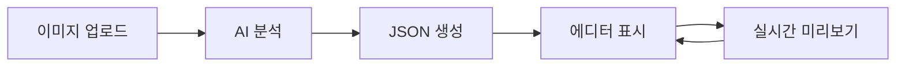

# MediTemplate AI - PRD (Product Requirements Document)

## 1. 프로젝트 개요

| 항목 | 내용 |
|------|------|
| **목표** | 병원 의료진의 비정형 요구사항(손그림, 스캔 문서)을 AI로 정형화된 JSON으로 변환하고, 웹에서 즉시 렌더링하여 검증 |
| **타겟 사용자** | 의료 영상 템플릿 기획자 및 엔지니어 |
| **핵심 가치** | 템플릿 기획-구현 간 간극 축소, UI 구조화 시간 단축 |

---

## 2. 사용자 플로우

1. **Upload**: 사용자가 손그림 이미지(JPG/PNG) 업로드
2. **AI Analysis**: 시스템이 이미지를 분석하여 계층적 JSON 생성
3. **JSON Editor**: 생성된 JSON을 에디터에서 직접 수정 가능
4. **Live Preview**: JSON이 실시간으로 Form UI로 렌더링

---

## 3. 기능 요구사항

### FR-1. 입력 처리
- 단일 이미지 업로드 (JPG, PNG)
- 향후 텍스트(Markdown) 확장 고려하여 모듈화

### FR-2. AI 생성 (Vision-to-JSON)
- **모델**: Gemini 1.5 Pro (Vision)
- **지원 컴포넌트**:
  - `Section` - 그룹핑 컨테이너
  - `Label` - 단순 텍스트 라벨
  - `TextInput` - 한 줄 입력
  - `TextArea` - 여러 줄 입력
  - `RadioGroup` - 단일 선택
  - `CheckboxGroup` - 다중 선택

### FR-3. UI 인터페이스
- **레이아웃**: 2-Column (Wide Mode)
- **왼쪽**: 이미지 업로더 + JSON 에디터
- **오른쪽**: Live Preview (폼 미리보기)
- **에러 처리**: JSON 문법 오류 시 에러 메시지 표시

---

## 4. 성공 기준

| 지표 | 목표 |
|------|------|
| 이미지→JSON 변환 성공률 | PoC 단계에서 기본 폼 인식 가능 |
| 사용자 수정 반영 | JSON 수정 시 즉시 미리보기 업데이트 |
| 에러 핸들링 | 잘못된 JSON 입력 시 명확한 에러 표시 |
